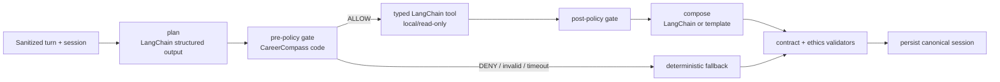

# ADR — AI runtime: LangChain + LangGraph tối giản

**Status:** Accepted for MVP, dependency versions fixed; graph activation guarded by spike gate 90 phút
**Owner:** M4 · Reviewer: M1/M3  
**Scope:** LangChain gateway/tool contracts dùng cho AI calls; LangGraph chỉ `POST /api/chat`; không graph hóa data pipeline hoặc `/api/recommendations`

## Quyết định

Dùng một ecosystem với ranh giới rõ:

- **LangChain Core + `langchain-openai`:** `ChatOpenAI`/`OpenAIEmbeddings`, messages,
  Pydantic structured output và typed tool schemas.
- **LangGraph `StateGraph`:** nối các node/conditional edges của bounded ReAct chat.
- **CareerCompass code:** sở hữu policy, session canonical, profile merge, timeout/budget,
  matching, ethics validators, fallback và API contract.

`backend/app/services/llm.py` là provider gateway duy nhất. Domain service không import
`ChatOpenAI`, `OpenAIEmbeddings` hoặc provider SDK. `agent_tools.py` được dùng LangChain
tool abstractions/Pydantic args nhưng policy quyết định tool có được chạy, không giao authority
cho model hoặc prompt.

### Phiên bản baseline đã chốt

| Package | Version | Vai trò |
|---|---:|---|
| `langchain-core` | `1.4.9` | messages/runnables/tool + structured contracts |
| `langchain-openai` | `1.3.5` | OpenAI-compatible chat and embedding adapters |
| `langgraph` | `1.2.9` | low-level StateGraph orchestration |
| `openai` | `2.45.0` | provider SDK dependency pinned for reproducible install |

Version chỉ đổi qua một dependency PR có install + unit/contract/integration evidence. Không
dùng floating latest giữa hackathon.

Không cài umbrella package `langchain`: MVP chỉ cần official `langchain-core` và
`langchain-openai`; bỏ agent factory dư thừa giúp dependency/import boundary nhỏ và tránh thành
viên vô tình dùng `create_agent`. Đây vẫn là LangChain application layer chính thức.

## Không dùng trong MVP

- LangChain `create_agent`, LangGraph prebuilt ReAct agent hoặc model-controlled open loop.
- LangSmith service/tracing config, Agent Server, cloud deployment hoặc Studio dependency.
  (`langsmith` có thể xuất hiện transitively từ package nhưng app không cấu hình/gọi dịch vụ.)
- LangGraph checkpointer/memory làm nguồn dữ liệu thứ hai.
- Multi-agent, subgraph, parallel tool execution hoặc human interrupt.
- Graph cho matching, market stats aggregation, pathways hay Launch readiness.
- Browser, shell, arbitrary HTTP, write config/KB hoặc external side-effect tool.

Session canonical vẫn ở SQLAlchemy `sessions.db`. Mỗi HTTP request load state, invoke graph
có budget, validate output rồi persist. `/api/recommendations` vẫn là deterministic pipeline.

## Vì sao không chỉ dùng LangChain `create_agent`?

Prebuilt agent giúp prototype nhanh nhưng ẩn bớt routing và có authority rộng hơn nhu cầu.
CareerCompass cần stage allowlist, privacy/provenance gates, tối đa hai tool/lượt và fallback
được test ở từng edge. Custom `StateGraph` thể hiện những ràng buộc này trực tiếp, đồng thời
vẫn dùng LangChain cho provider/tool/structured-output plumbing.

## Nếu graph bị tắt thì dùng gì?

Fallback là **plain Python bounded orchestrator**: `Enum` stage + Pydantic `AgentPlan` + cùng
LangChain-typed tool registry + policy function + vòng lặp tối đa hai tools. Model calls vẫn đi
qua LangChain gateway; chỉ bỏ LangGraph routing. Vì vậy `AGENT_MODE=deterministic` không đổi API,
tool contracts hoặc recommendation core.

## Spike gate — tối đa 90 phút trong PR-12

Dependency đã pin để team cài cùng baseline; chỉ bật `AGENT_MODE=langgraph` khi tất cả pass:

- `StateGraph` compile/invoke với fake structured planner, không network và không đổi API contract.
- LangChain tool args sinh schema đúng; unknown tool, policy deny, invalid output và timeout đều
  về deterministic fallback.
- Không log raw transcript/CoT; graph state chỉ chứa dữ liệu JSON-serializable đã sanitize.
- `tests/unit` + `tests/contract` + `tests/integration` và graph-targeted tests pass.
- Overhead orchestration không LLM `<100ms p95` trên 100 fixture turns.
- `AGENT_MODE=deterministic` chạy cùng contract mà không compile/invoke graph path.

Nếu gate fail: giữ dependencies/gateway đã kiểm thử, không bật graph; dùng bounded Python
orchestrator và không làm trễ PR-03/PR-05/data critical path.

## Lý do phù hợp

- LangChain chuẩn hóa model/embedding/tool schemas, giảm code provider-specific.
- LangGraph cho graph rõ để giải thích với judge và test conditional policy/fallback.
- Deterministic domain core ngăn agent tự xếp hạng hay đóng khung người học.
- Cùng contracts chạy được live, fake và replay; thuận lợi cho sáu thành viên dùng AI song song.
- Sau MVP có đường mở durable execution/HITL nếu counselor approval thực sự cần.

## Trigger mở rộng sau MVP

Chỉ bật checkpointer/HITL/subgraph khi có use case thật: counselor cần pause/approve, workflow
kéo dài nhiều ngày, external write tool hoặc node cần resume sau failure. Trước đó phải review
privacy/retention/source-of-truth, load test và viết ADR mới; không bật chỉ vì framework hỗ trợ.
