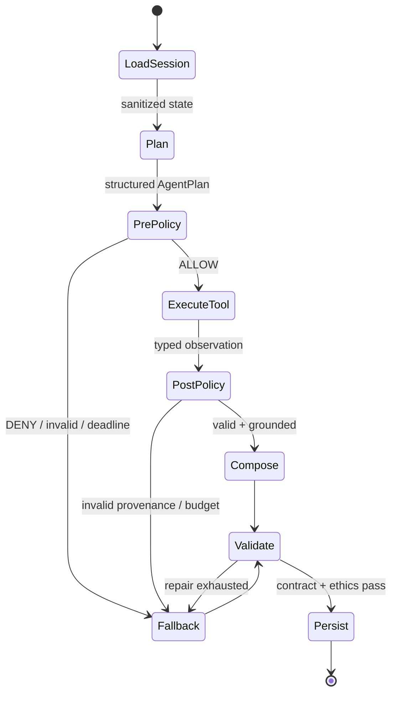
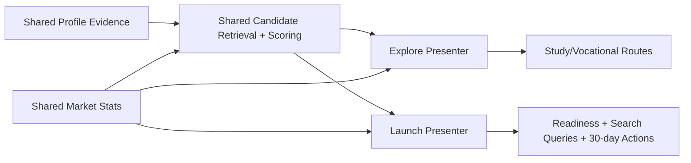

# 🏗 ARCHITECTURE — CareerCompass

## 1. Tổng quan hệ thống

```mermaid
graph TB
  subgraph "Offline — Data Pipeline (chạy 1 lần + có thể chạy lại)"
    A[Crawlers<br/>TopCV / VietnamWorks / ITviec] -->|JSONL raw| B[normalize.py<br/>chuẩn hóa lương, vùng, dedupe]
    B --> C[extract_skills.py<br/>hybrid: taxonomy dict + LLM]
    C --> D[build_market_stats.py<br/>aggregate theo career × region]
    D --> E[(SQLite<br/>market.db)]
  end

  subgraph "Backend — FastAPI :8000"
    E --> H[/api/market/*<br/>stats, skill gap/]
    E --> I[Matching Engine<br/>5D fit + skill overlap + market signal]
    J[/api/chat<br/>Bounded ReAct Profiler/] --> R[LangGraph StateGraph<br/>custom nodes + policy + budget]
    R --> K[(SQLite<br/>sessions.db)]
    I --> L[/api/recommendations<br/>top5 + stretch + evidence + pathway/]
    L --> W[/api/recommendations/what-if<br/>deep-copy deterministic preview/]
    L --> X[/api/research/careers<br/>bounded research stage/]
    X -.-> Y[DDGS community adapter<br/>timeout + cache + URL policy]
    R -.->|structured planner/composer| M[LangChain Gateway<br/>ChatOpenAI<br/>provider config via env]
    L -.->|evidence gen| M
  end

  subgraph "Frontend — Next.js :3000"
    N[Landing /<br/>Explore | Launch] --> O[/explore<br/>Chat + Profile/Experience live/]
    O --> P[/results<br/>Career + Evidence + Decision Lab/]
    Q[/market<br/>Radar nhu cầu kỹ năng/]
  end

  O <-->|REST JSON| J
  P <-->|REST JSON| L
  P <-->|preview + typed citations| W
  P <-->|explicit research intent| X
  Q <-->|REST JSON| H
```

**3 khối tách rời** — đây là quyết định quan trọng nhất:

1. **Data pipeline (offline)** — script Python chạy tay, output là file + SQLite. Chết cũng không ảnh hưởng app đang chạy. Chạy lại được từng bước (mỗi bước đọc file của bước trước).
2. **Backend (online)** — FastAPI stateless, chỉ ĐỌC dữ liệu pipeline đã build + gọi LLM cho chat/evidence. Không crawl, không batch trong request path.
3. **Frontend** — Next.js gọi REST, có mock mode hoàn chỉnh (chạy được cả khi BE chết).

### Runtime/state ownership

| State/artifact | Writer | Readers | Lifetime/version rule |
|---|---|---|---|
| Browser `session_id`, selected mode | FE | FE/BE | reset/delete by user; no PII |
| Session profile/messages | Profiler service | chat/recommender | SQLite demo, TTL target 24h; mode locked |
| Raw/processed full text | M2 pipeline | M3 batch only, local/CI-secure storage | immutable snapshot ID + SHA-256; never committed |
| Taxonomy/career KB | M3 / M2+M4 | extraction/matching | semantic version/hash; refresh vectors together |
| Market DB | stats builder | market/matching services read-only | atomic build then swap; meta has input hashes |
| Five-dimension career vectors | versioned career KB | matching read-only | named dimensions; same space as profile |
| Replay fixtures | M1/M4 | demo routers | fictional data; contract version/commit |

Không service online nào ghi raw/processed/market stats. Không pipeline nào đọc session data.

## 2. Data flow chính (request path)

### Chat profiling
```
FE POST /api/chat {session_id, message, journey_mode}
 → load session state (SQLite)
 → lock journey_mode on opening turn
 → agent policy xác định stage + allowed tool set (shared phases, mode-specific completeness)
 → planner LLM trả tool-plan JSON; policy validate schema/privacy/budget
 → release gọi đúng 1 typed internal tool (policy budget hard-cap 2 chỉ để chặn loop), tạo provenance observation
 → composer LLM hoặc deterministic fallback trả reply; merge validated profile evidence, lưu session
 → trả {reply, profile, phase, done}
```

Agent không có shell/browser/write tool tổng quát. Sau recommendation, stage `research` có đúng một external read tool `search_career_sources`: query do code dựng từ career KB + enum, tối đa 5 kết quả, timeout/cache/URL policy và không nhận raw profile. LangChain chuẩn hóa model calls, structured output và typed tool schemas; LangGraph chỉ route state của `/api/chat`. Matching, routes, readiness và mọi market number vẫn qua deterministic domain functions; xem `AGENTIC_RUNTIME.md`.



Node `Plan`/`Compose` gọi LangChain gateway; node policy/tool/validate là CareerCompass code. Graph không persist private state và không chạy trên recommendation path.

**Ranh giới bắt buộc:** LangGraph planner chỉ chạy trong `/api/chat` để chọn tool thu thập/xác nhận evidence. `/api/recommendations` không có planner; toàn bộ candidate retrieval, score, stretch, route, readiness và validation chạy deterministic. `/api/research/careers` chỉ chạy sau recommendation với explicit user intent qua policy + typed tool registry; search result không quay lại scoring.

### Recommendation
```
FE POST /api/recommendations {session_id}
 → load profile
 → profile_dimensions (KHÔNG gồm giới tính/region/trường/GPA)
 → cosine với career dimensions trong KB → top 20 ứng viên
 → rescore: α·cosine + β·skill_overlap + γ·market_signal  (config trong app/core/config.py)
 → top 5 + 1 stretch (điểm cao nhất NGOÀI cluster sở thích chính)
 → với mỗi career: đính stats từ market.db + routes từ career KB
 → LLM sinh evidence (input = quotes của học sinh + stats; prompt cấm sinh số mới)
 → nếu launch: code tính readiness band + matched/missing skills;
   template/LLM sinh action wording nhưng deliverable/skill references được validate
 → trả RecommendationResponse (xem API_CONTRACT.md)
```

### Mode composition — không fork hệ thống



`journey_mode` chỉ đổi câu hỏi, completeness và lớp trình bày/action; không tạo crawler, taxonomy, matching engine hoặc database riêng. Điều này giữ scope 48h và tránh hai sản phẩm không đồng bộ.

### Service boundaries

| Layer | Responsibility | Must not do |
|---|---|---|
| Router | validate HTTP, call service, map errors/schema | scoring, SQL aggregation, prompts |
| Profiler service | state/completeness/merge/session | career ranking or UI copy |
| Agent orchestrator/policy | choose allowlisted tool order, validate budget/privacy/provenance, produce safe observations | arbitrary tool/URL/code execution, ranking verdict, hidden reasoning persistence |
| Matching service | retrieve/score/diversify/readiness inputs | call crawler, invent evidence |
| Market service | read typed stats/meta | scan raw JSON or call LLM |
| Career research service | build allowlisted query, DDGS/replay/local fallback, sanitize typed citations | receive raw transcript/profile PII, fetch arbitrary pages, change ranking |
| LangChain LLM gateway | instantiate provider adapters; structured call/embed/log/retry/timeout | business decisions/session persistence or exposing provider classes |
| Presenter/evidence | validated wording/template | choose candidates or create numbers |
| FE API client | network/mock/error normalization | render/component state |
| Components | render/accessibility/interactions | direct fetch or contract transformation scattered across UI |

## 3. Quyết định kiến trúc & lý do (ADR rút gọn)

| # | Quyết định | Lý do | Trade-off chấp nhận |
|---|---|---|---|
| 1 | SQLite thay vì Postgres | Zero setup, file-based, đủ cho vài nghìn postings + demo | Không concurrent write tốt — OK vì write chỉ xảy ra ở pipeline offline |
| 2 | Cosine 5 chiều in-process, không vector DB | 25 careers, vector có tên và giải thích được; vector DB không tăng chất lượng | Khi KB >10k và cùng-space embedding thắng baseline mới cân nhắc ANN |
| 3 | LLM Gateway 1 module duy nhất (`app/services/llm.py`) | Đổi provider/model = đổi env var; mock được toàn bộ khi test; đếm chi phí 1 chỗ | — |
| 4 | Hybrid skill extraction (dict trước, LLM sau) | Dict: rẻ + deterministic + nhanh cho 80% case; LLM: bắt cách diễn đạt lạ | Phải maintain taxonomy — chính là tài sản của sản phẩm |
| 5 | Pipeline offline tách khỏi serving | Demo không phụ thuộc crawl; chạy lại từng bước; đúng câu chuyện scalability | "Real-time" thành "near-real-time" — chấp nhận, pitch rõ |
| 6 | Session state server-side, session_id ở localStorage | Không cần auth trong 48h nhưng vẫn giữ được hội thoại khi F5 | Không cross-device — out of scope |
| 7 | Profile schema KHÔNG có field giới tính | Anti-bias by design — không thể leak thứ không tồn tại | Không cá nhân hóa xưng hô — dùng "em/bạn" trung tính |
| 8 | Explore/Launch dùng shared core | Bám cả chọn ngành và thất nghiệp sau tốt nghiệp mà không nhân đôi architecture | Launch MVP không match vacancy/công ty cụ thể |
| 9 | Readiness dùng 3 band deterministic, không xác suất | Giải thích/test được; tránh false precision và hiring prediction | Ít “wow” hơn % score nhưng đáng tin hơn |
| 10 | LangChain model/tool contracts + custom LangGraph `StateGraph` cho bounded chat agent | Provider/tool schema thống nhất; conditional policy/fallback rõ, replay/test được | Pinned dependencies; không `create_agent`/prebuilt/multi-agent/checkpointer |

## 4. Cấu trúc thư mục (chuẩn — đặt file mới đúng chỗ)

```
backend/
├── app/
│   ├── main.py               # FastAPI app, CORS, mount routers
│   ├── core/
│   │   ├── config.py         # Settings từ env (pydantic-settings) — MỌI config ở đây
│   │   └── db.py             # SQLAlchemy engine/session
│   ├── models/
│   │   ├── schemas.py        # public API = mirror API_CONTRACT.md
│   │   ├── profiler_io.py    # internal profiler delta
│   │   ├── agent_schemas.py  # internal agent plan/policy/trace meta
│   │   └── session_orm.py    # SQLAlchemy session rows
│   ├── routers/
│   │   ├── chat.py           # POST /api/chat, profile endpoints
│   │   ├── recommend.py      # recommendations + deterministic what-if preview
│   │   ├── research.py       # POST /api/research/careers, policy + typed tool
│   │   └── market.py         # GET /api/market/*
│   ├── services/
│   │   ├── llm.py            # LangChain Gateway — MỌI model/embedding instance ở đây
│   │   ├── profiler.py       # state machine hội thoại (+ PR-13 agent enrich)
│   │   ├── session_store.py  # SQLite session persistence
│   │   ├── agent_chat.py     # PR-13: wire bounded agent into /api/chat
│   │   ├── agent_graph.py    # PR-12: StateGraph or plain_python orchestrator
│   │   ├── agent_policy.py   # PR-12: stage allowlist, privacy, budget, provenance
│   │   ├── agent_tools.py    # 11 typed tools incl. bounded research (registry v2)
│   │   ├── matching.py       # scoring engine (deterministic; no agent planner)
│   │   ├── evidence.py       # grounded why + counterfactual
│   │   ├── pathways.py       # study routes + Launch readiness
│   │   ├── what_if.py        # pure deep-copy preview + rank/score delta
│   │   ├── career_research.py # DDGS/cache/sanitize/local fallback; no scoring authority
│   │   └── market.py         # đọc market.db
│   ├── prompts/              # MỌI prompt ở đây, có version comment
│   └── data/seed_loader.py   # load seed khi chưa có data thật
├── tests/
│   ├── unit/                 # pure domain/policy/parser/scoring/agent red-team
│   ├── contract/             # Pydantic/OpenAPI/fixture parity + agent tools
│   ├── integration/          # FastAPI + services + seed/temp storage
│   ├── e2e/                  # Explore/Launch/replay journeys
│   └── fixtures/             # fictional, sanitized (profiler/, agent/)
├── pytest.ini                # strict markers; canonical testpaths
├── scripts/test_chat.py      # test hội thoại từ terminal, không cần FE
└── requirements.txt

frontend/
├── app/                      # App Router: / (landing), /explore, /results, /market
├── components/               # chat/, profile/, results/ (DecisionLab), market/, ui/
├── lib/
│   ├── api.ts                # MỌI call API + toàn bộ MOCK ở đây
│   └── mock/                 # mock responses khớp contract
└── types/index.ts            # TypeScript types = mirror của API_CONTRACT.md

data/
├── pipeline/                 # các bước, đánh số thứ tự chạy
├── taxonomy/skills_vi.json   # từ điển kỹ năng VN
├── raw/        (gitignored)  # crawl output
├── processed/  (gitignored)  # sau normalize/extract
└── seed/careers_seed.json    # Career KB + demo data — COMMIT file này
```

**Rule đồng bộ 3 nơi:** khi contract đổi → sửa `API_CONTRACT.md` + `backend/app/models/schemas.py` + `frontend/types/index.ts` trong CÙNG một PR.

## 5. Scalability — đường lên production (nói trong pitch, không code trong 48h)

Thiết kế hiện tại cố tình để mỗi thành phần có "đường thăng cấp" rõ:

| Thành phần | Hackathon | Production | Việc phải làm |
|---|---|---|---|
| DB | SQLite | Postgres + pgvector | Đổi connection string (đã dùng SQLAlchemy); chuyển cosine sang pgvector index |
| Crawl | Chạy tay 1 lần | Scheduler (Airflow/cron) crawl mỗi ngày, incremental theo posted_date | Pipeline đã idempotent + từng bước độc lập → chỉ thêm orchestrator |
| Skill extraction | Batch script + cache | Queue worker (Celery), chỉ xử lý posting mới | Logic giữ nguyên, bọc vào worker |
| Market stats | Build lại toàn bộ | Materialized views, refresh theo lịch | Query giữ nguyên |
| LLM | LangChain gateway gọi provider | cache theo prompt/input hash, rate limit, provider fallback | Gateway là 1 module; domain không đổi |
| Agent | Custom LangGraph StateGraph, no checkpointer; session in SQLAlchemy | optional durable execution/HITL only after privacy review | Giữ policy/tool contracts; viết ADR mới trước khi mở authority |
| Serving | 1 instance Render | Backend stateless → scale ngang sau load balancer; session sang Redis | Đổi session store |
| FE | Vercel | Vercel (giữ nguyên) + ISR cho trang market | — |
| Mới | — | Counselor dashboard, school integration, API cho trường học | Feature mới trên nền data đã có |
| Graduate Launch | role-family + search query + action plan | vacancy API, CV evidence import, outcome feedback | Chỉ mở sau source permission/privacy/fairness gates |

Điểm nhấn pitch: **"Mọi con số demo hôm nay đến từ pipeline có thể chạy mỗi đêm — real-time hóa là việc thêm scheduler, không phải viết lại."**

### Scale trigger, không scale theo cảm tính

| Trigger đo được | Upgrade |
|---|---|
| SQLite lock/error hoặc >50 concurrent sessions trong load test | Postgres sessions; Redis chỉ nếu latency/session TTL cần |
| Career KB >10k, cùng-space embedding đã thắng evaluation và p95 retrieval >100ms | pgvector/ANN; trước đó giữ scorer in-process |
| Daily new postings > batch window hoặc extraction >2h | queue workers + incremental jobs |
| Source freshness SLA <24h | scheduler + source monitoring/contracts |
| Multi-school pilot có PII/roles | auth/RBAC/audit log/tenant isolation trước dashboard |

Không đưa production technology vào MVP nếu chưa có trigger; mỗi dependency là thêm failure mode.

## 6. Bảo mật & vận hành tối thiểu (mức hackathon)

- Secrets chỉ ở env vars (Render/Vercel dashboard + `.env` local, đã gitignore).
- CORS: chỉ allow origin FE (config trong `main.py`).
- Rate limit thô cho `/api/chat` (chống trẻ em spam lúc demo booth): 30 req/phút/session.
- Log mọi LLM call (model, tokens, latency) ra console — debug chi phí và chậm ở đâu.
- `/api/health` trả `{status, llm_ok, data_loaded}` — M1 check sau mỗi deploy.
- Student-data retention, source-use và release checklist: `docs/SECURITY_PRIVACY.md`.

### Failure matrix và degradation

| Failure | Detect | User behavior | Operator action |
|---|---|---|---|
| Chat provider timeout/JSON fail | gateway metric/retry exhausted | deterministic phase question, session preserved | replay for demo; inspect prompt/model |
| Embedding experiment unavailable/mismatch | artifact guard từ chối bật | giữ baseline 5 chiều + skill overlap | không đưa experiment vào release runtime |
| Market DB missing/hash mismatch | health `data_loaded=false` | explicit seed/mock label, no “real data” claim | restore release artifact |
| FE cannot reach BE | normalized API error | retry then mock/replay path for demo | check CORS/deploy health |
| Low sample | schema `low_confidence` | hide trend/salary, explain limitation | collect more data later |
| Contract mismatch | CI/type/schema fixture | block merge/deploy | contract owner fixes all 3 places |

### Observability minimum

- Request ID per API request; structured log event, status, latency, mode — no raw user content.
- LLM metric: provider/model/prompt version, tokens, latency, retry/fallback, estimated cost.
- Data metric: snapshot/hash/count/source/region/coverage; build duration/error count.
- Product demo metric is manual/anonymized; no analytics SDK is required in 48h.
- Health distinguishes service alive, market artifact loaded and LLM key configured; it does not claim provider is healthy without an actual bounded check.

## 7. Capacity assumptions & NFR

| Dimension | MVP assumption | Gate |
|---|---|---|
| Career KB | P0 ≥25, target 40–60 careers | cosine in-memory, artifact khớp KB hash |
| Market snapshot | target 3k postings, 3 regions | aggregate offline; API không scan raw JSONL mỗi request |
| Demo concurrency | 1–10 sessions | rate limit 30 chat req/min/session; SQLite đủ |
| Latency | chat p95 <5s; recommendation p95 <8s | đo theo EVALUATION.md, replay khi provider fail |
| Availability demo | 3 E2E runs, 0 unhandled 5xx | FE mock + BE replay + video backup |
| Data freshness | snapshot có `built_at`/window/source | không dùng từ “real-time” trong MVP |
| Privacy | không PII, TTL 24h mục tiêu | raw chat không vào log/replay |

Các con số production trong §5 là đường nâng cấp, không phải tuyên bố MVP đã chịu tải production.
