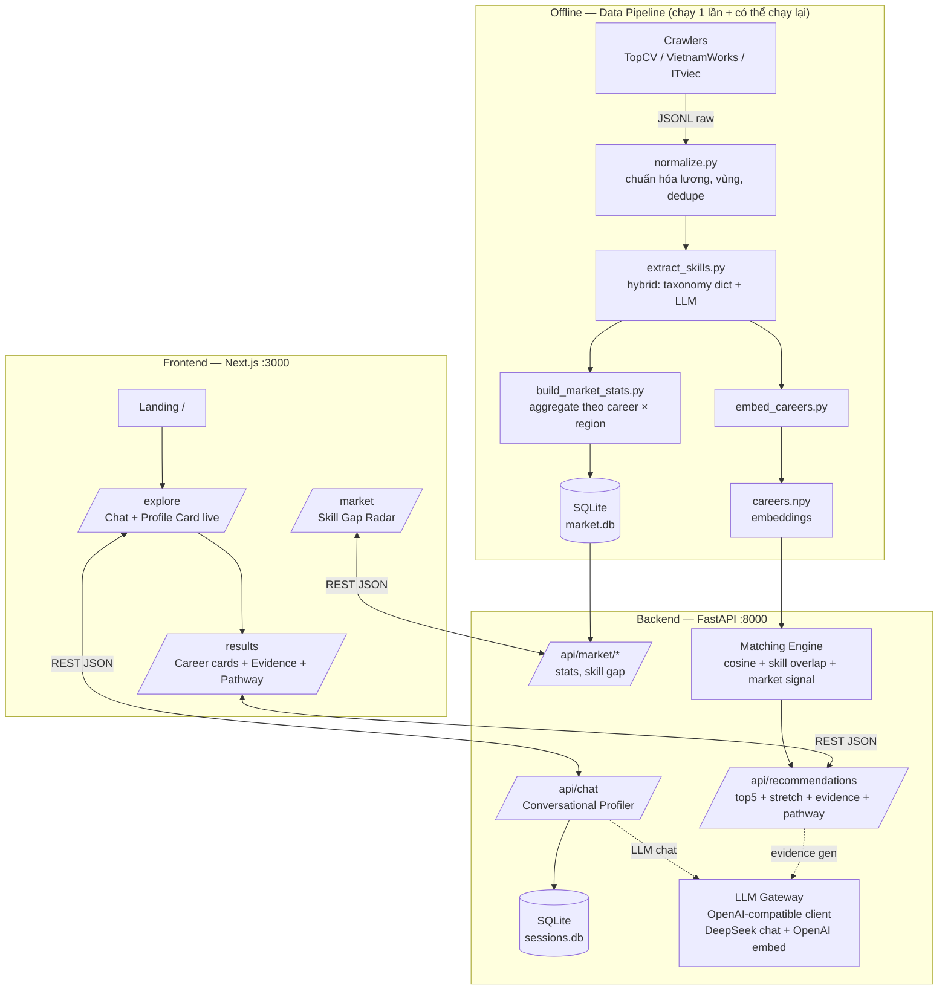

# 🏗 ARCHITECTURE — CareerCompass

## 1. Tổng quan hệ thống



**3 khối tách rời** — đây là quyết định quan trọng nhất:

1. **Data pipeline (offline)** — script Python chạy tay, output là file + SQLite. Chết cũng không ảnh hưởng app đang chạy. Chạy lại được từng bước (mỗi bước đọc file của bước trước).
2. **Backend (online)** — FastAPI stateless, chỉ ĐỌC dữ liệu pipeline đã build + gọi LLM cho chat/evidence. Không crawl, không batch trong request path.
3. **Frontend** — Next.js gọi REST, có mock mode hoàn chỉnh (chạy được cả khi BE chết).

## 2. Data flow chính (request path)

### Chat profiling
```
FE POST /api/chat {session_id, message}
 → load session state (SQLite)
 → state machine chọn phase (warmup/interests/abilities/constraints/wrapup)
 → LLM call (structured output): {reply, profile_delta, phase, done}
 → validate bằng Pydantic; fail → retry tối đa 2 lần với error feedback
 → merge profile_delta vào profile, lưu session
 → trả {reply, profile, phase, done}
```

### Recommendation
```
FE POST /api/recommendations {session_id}
 → load profile
 → profile_text = serialize(profile KHÔNG gồm giới tính — field này không tồn tại trong schema)
 → embed(profile_text) → cosine với careers.npy → top 20 ứng viên
 → rescore: α·cosine + β·skill_overlap + γ·market_signal  (config trong app/core/config.py)
 → top 5 + 1 stretch (điểm cao nhất NGOÀI cluster sở thích chính)
 → với mỗi career: đính stats từ market.db + routes từ career KB
 → LLM sinh evidence (input = quotes của học sinh + stats; prompt cấm sinh số mới)
 → trả RecommendationResponse (xem API_CONTRACT.md)
```

## 3. Quyết định kiến trúc & lý do (ADR rút gọn)

| # | Quyết định | Lý do | Trade-off chấp nhận |
|---|---|---|---|
| 1 | SQLite thay vì Postgres | Zero setup, file-based, đủ cho vài nghìn postings + demo | Không concurrent write tốt — OK vì write chỉ xảy ra ở pipeline offline |
| 2 | Cosine in-process (NumPy) thay vì vector DB | ~50 careers × 1536 dims = quá nhỏ; thêm vector DB là over-engineering | Không scale đến triệu vectors — chưa cần |
| 3 | LLM Gateway 1 module duy nhất (`app/services/llm.py`) | Đổi provider/model = đổi env var; mock được toàn bộ khi test; đếm chi phí 1 chỗ | — |
| 4 | Hybrid skill extraction (dict trước, LLM sau) | Dict: rẻ + deterministic + nhanh cho 80% case; LLM: bắt cách diễn đạt lạ | Phải maintain taxonomy — chính là tài sản của sản phẩm |
| 5 | Pipeline offline tách khỏi serving | Demo không phụ thuộc crawl; chạy lại từng bước; đúng câu chuyện scalability | "Real-time" thành "near-real-time" — chấp nhận, pitch rõ |
| 6 | Session state server-side, session_id ở localStorage | Không cần auth trong 48h nhưng vẫn giữ được hội thoại khi F5 | Không cross-device — out of scope |
| 7 | Profile schema KHÔNG có field giới tính | Anti-bias by design — không thể leak thứ không tồn tại | Không cá nhân hóa xưng hô — dùng "em/bạn" trung tính |

## 4. Cấu trúc thư mục (chuẩn — đặt file mới đúng chỗ)

```
backend/
├── app/
│   ├── main.py               # FastAPI app, CORS, mount routers
│   ├── core/
│   │   ├── config.py         # Settings từ env (pydantic-settings) — MỌI config ở đây
│   │   └── db.py             # SQLAlchemy engine/session
│   ├── models/
│   │   └── schemas.py        # Pydantic models = mirror của API_CONTRACT.md
│   ├── routers/
│   │   ├── chat.py           # POST /api/chat, profile endpoints
│   │   ├── recommend.py      # POST /api/recommendations
│   │   └── market.py         # GET /api/market/*
│   ├── services/
│   │   ├── llm.py            # LLM Gateway — MỌI call LLM/embedding đi qua đây
│   │   ├── profiler.py       # state machine hội thoại
│   │   ├── matching.py       # scoring engine
│   │   └── market.py         # đọc market.db
│   ├── prompts/              # MỌI prompt ở đây, có version comment
│   └── data/seed_loader.py   # load seed khi chưa có data thật
├── scripts/test_chat.py      # test hội thoại từ terminal, không cần FE
└── requirements.txt

frontend/
├── app/                      # App Router: / (landing), /explore, /results, /market
├── components/               # chat/, profile/, results/, market/, ui/
├── lib/
│   ├── api.ts                # MỌI call API + toàn bộ MOCK ở đây
│   └── mock/                 # mock responses khớp contract
└── types/index.ts            # TypeScript types = mirror của API_CONTRACT.md

data/
├── pipeline/                 # các bước, đánh số thứ tự chạy
├── taxonomy/skills_vi.json   # từ điển kỹ năng VN
├── raw/        (gitignored)  # crawl output
├── processed/  (gitignored)  # sau normalize/extract
└── seed/careers_seed.json    # Career KB + demo data — COMMIT file này
```

**Rule đồng bộ 3 nơi:** khi contract đổi → sửa `API_CONTRACT.md` + `backend/app/models/schemas.py` + `frontend/types/index.ts` trong CÙNG một PR.

## 5. Scalability — đường lên production (nói trong pitch, không code trong 48h)

Thiết kế hiện tại cố tình để mỗi thành phần có "đường thăng cấp" rõ:

| Thành phần | Hackathon | Production | Việc phải làm |
|---|---|---|---|
| DB | SQLite | Postgres + pgvector | Đổi connection string (đã dùng SQLAlchemy); chuyển cosine sang pgvector index |
| Crawl | Chạy tay 1 lần | Scheduler (Airflow/cron) crawl mỗi ngày, incremental theo posted_date | Pipeline đã idempotent + từng bước độc lập → chỉ thêm orchestrator |
| Skill extraction | Batch script + cache | Queue worker (Celery), chỉ xử lý posting mới | Logic giữ nguyên, bọc vào worker |
| Market stats | Build lại toàn bộ | Materialized views, refresh theo lịch | Query giữ nguyên |
| LLM | Gọi trực tiếp | Thêm cache layer theo (prompt-hash), rate limit, fallback model tự động | Gateway đã là 1 module — chèn middleware |
| Serving | 1 instance Render | Backend stateless → scale ngang sau load balancer; session sang Redis | Đổi session store |
| FE | Vercel | Vercel (giữ nguyên) + ISR cho trang market | — |
| Mới | — | Counselor dashboard, school integration, API cho trường học | Feature mới trên nền data đã có |

Điểm nhấn pitch: **"Mọi con số demo hôm nay đến từ pipeline có thể chạy mỗi đêm — real-time hóa là việc thêm scheduler, không phải viết lại."**

## 6. Bảo mật & vận hành tối thiểu (mức hackathon)

- Secrets chỉ ở env vars (Render/Vercel dashboard + `.env` local, đã gitignore).
- CORS: chỉ allow origin FE (config trong `main.py`).
- Rate limit thô cho `/api/chat` (chống trẻ em spam lúc demo booth): 30 req/phút/session.
- Log mọi LLM call (model, tokens, latency) ra console — debug chi phí và chậm ở đâu.
- `/api/health` trả `{status, llm_ok, data_loaded}` — M1 check sau mỗi deploy.
