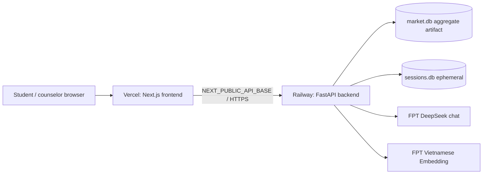

# Deploy production — Vercel frontend + Railway backend

> Secret chỉ nhập trong dashboard. Không commit `.env`, không paste key vào PR/log/screenshot. Sau khi một key xuất hiện trong chat, rotate key trước production.

## Kiến trúc deploy



## 1. Railway — deploy backend trước

1. Railway → New Project → Deploy from GitHub repo → chọn repository CareerCompass.
2. Service Settings:
   - Root Directory: `/backend`
   - Config file path: `/backend/railway.json`
   - Branch: branch release hiện tại hoặc `main` sau merge.
3. Variables → copy toàn bộ key từ `backend/.env.railway.example`.
   - Điền `CHAT_API_KEY` và `EMBED_API_KEY` bằng key FPT đã rotate.
   - Tạm đặt `CORS_ORIGINS=https://placeholder.invalid` trong lần deploy đầu.
   - Không thêm dấu nháy quanh value; không để comment cuối dòng.
4. Generate Domain. Ghi lại URL dạng `https://<service>.up.railway.app`, không thêm `/` cuối.
5. Verify:

```bash
curl https://<service>.up.railway.app/api/health
```

Expected: `status=ok`, `llm_configured=true`, legacy alias `llm_ok=true`,
`market_db_loaded=true`, `postings_count=298`. Health không gọi model; chạy thêm đúng một
bounded chat smoke để chứng minh provider reachable.

`railway.json` dùng Railpack, cài dependency pin, fail build nếu thiếu `market.db`, start Uvicorn bằng `$PORT`, health check `/api/health` và restart tối đa ba lần khi process lỗi.

## 2. Vercel — deploy frontend

1. Vercel → Add New Project → import cùng repository.
2. Root Directory: `frontend`. Framework phải được nhận là Next.js.
3. Environment Variables cho Production và Preview:

```env
NEXT_PUBLIC_API_BASE=https://<service>.up.railway.app
NEXT_PUBLIC_USE_MOCK=0
NEXT_TELEMETRY_DISABLED=1
```

4. Deploy và ghi lại production URL dạng `https://<project>.vercel.app`.

`NEXT_PUBLIC_API_BASE` được đóng vào frontend lúc build; thay URL phải redeploy Vercel.

## 3. Khóa CORS sau khi có Vercel URL

1. Railway Variables → đổi:

```env
CORS_ORIGINS=https://<project>.vercel.app
```

2. Redeploy Railway.
3. Không dùng `*`. Nếu có custom domain, dùng danh sách phân tách bằng dấu phẩy:

```env
CORS_ORIGINS=https://careercompass.vn,https://www.careercompass.vn
```

Preview Vercel có domain thay đổi theo deployment nên không tự động được allow. Demo production dùng production domain cố định; preview cần thêm đúng origin khi thật sự test.

## 4. Production smoke test

- Railway `/api/health`: `llm_configured=true`, `market_db_loaded=true`, 298 postings; sau đó
  một bounded chat smoke trả 200 mà không rơi về deterministic fallback ngoài dự kiến.
- Vercel landing, `/explore`, `/market`, `/results` mở được trên cửa sổ ẩn danh/mobile.
- Explore gửi ít nhất hai lượt và profile thay đổi; Network tab không có CORS/5xx.
- Recommendation có 5 hướng + stretch, source note, ≥2 routes và ≥1 route ngoài đại học.
- Launch có readiness/actions; profile correction lưu được.
- Railway logs không chứa API key, raw transcript hoặc chain-of-thought.

## 5. Rollback / kill switches

| Failure | Railway/Vercel variable | Hành động |
|---|---|---|
| LangGraph lỗi | `AGENT_MODE=deterministic` | Redeploy Railway; API contract giữ nguyên |
| FPT chat/network lỗi | `DEMO_MODE=replay` | Redeploy Railway; dùng fictional replay |
| Backend chết trước demo | `NEXT_PUBLIC_USE_MOCK=1` | Redeploy Vercel |
| CORS lỗi | `CORS_ORIGINS=<exact Vercel origin>` | Redeploy Railway |
| Release mới lỗi | Railway/Vercel deployment history | Rollback về commit/deployment xanh gần nhất |

## 6. Giới hạn Railway SQLite

- `market.db` là aggregate artifact trong image/repo nên có lại sau mỗi deploy.
- `sessions.db` nằm trên filesystem ephemeral; restart/redeploy có thể làm mất session. Đây là chấp nhận được cho hackathon.
- Không scale nhiều replica với SQLite session writes. Khi cần nhiều replica, chuyển session DB sang Postgres bằng `SESSIONS_DB_URL`; không đổi API/domain services.

## 7. Giá trị cần ghi lại trong preflight

```md
Commit deployed: ...
Railway URL: ...
Vercel URL: ...
Railway health: ...
CORS exact origin verified: PASS|FAIL
Explore/Launch smoke: PASS|FAIL
Kill-switch drill: PASS|FAIL
Owner/time: ...
```
