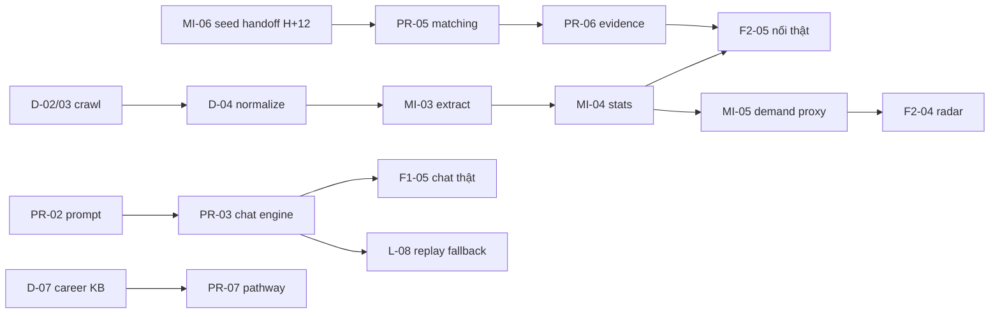

# ✅ TASKS — Breakdown chi tiết cho 6 thành viên

> Quy ước:
> - Task ID: `L-xx` (Lead), `D-xx` (Data), `MI-xx` (Market Intelligence AI), `PR-xx` (Profiling/Recommender AI), `F1-xx` (FE profiling), `F2-xx` (FE dashboard).
> - Mỗi task có: mô tả, giờ dự kiến (ước lượng, được phép lệch), phụ thuộc, **DoD** (Definition of Done — điều kiện để tick ✅).
> - **Handoff** = điểm bàn giao giữa 2 người: người giao phải báo trong group + link PR/file cụ thể.
> - Branch đặt tên theo task: `feat/PR-03-matching-engine`.
> - Khi nhờ AI code: paste `CLAUDE.md` (root + của package) + nguyên văn task này vào prompt.

---

## M1 — Team Lead / Integrator / DevOps

**Mục tiêu vai:** main luôn chạy được, không ai bị block quá 90 phút, demo không được phép chết.

| ID | Task | Giờ | Phụ thuộc | DoD |
|---|---|---|---|---|
| L-01 | Kickoff: walkthrough PLAN 20', chốt API contract v1 cùng cả team, tạo group chat + kênh `#blockers`, phân quyền GitHub | H+0→2 | — | Cả 6 người xác nhận đã chạy được FE+BE local |
| L-02 | Setup GitHub: branch protection `main` (require 1 review), PR template (có sẵn), labels theo task prefix | H+1 | — | Push thẳng main bị chặn |
| L-03 | Deploy skeleton NGAY: FE lên Vercel, BE lên Render/Railway, nối env vars | H+2→5 | — | URL public trả về trang chào + `/api/health` OK |
| L-04 | Viết `scripts/dev.md`: lệnh chạy từng phần + troubleshoot lỗi hay gặp (port, venv, node version) | H+3 | — | Thành viên mới setup được < 10' chỉ bằng doc |
| L-05 | Trực integrate: review + merge PR liên tục, chạy smoke test sau mỗi merge, giữ `main` xanh | Suốt 48h | — | Không có commit nào làm main chết > 30' |
| L-06 | Chốt "go/no-go" dữ liệu tại H+10 (đủ ≥1k postings chưa? nếu không → kích hoạt plan B Kaggle, báo M2) | H+10 | D-02 | Quyết định ghi vào #blockers, M2+M3 biết hướng đi |
| L-07 | End-to-end test mỗi 4h từ H+20: chạy full flow 2 persona, ghi bug vào GitHub Issues gắn label người phụ trách | H+20→44 | M2 mốc | Danh sách bug được xử lý theo mức ưu tiên |
| L-08 | **Cached-replay fallback**: ghi lại response LLM của 2 persona demo vào JSON; env `DEMO_MODE=replay` → BE trả cached thay vì gọi LLM. **Làm SỚM ngay sau PR-04** — đây là lưới an toàn duy nhất của demo, làm sớm còn giúp FE dev không đốt token LLM | H+18→22 | PR-04 | Rút mạng LLM vẫn demo được full flow |
| L-09 | Pitch deck (cùng M6): problem → demo → differentiators → anti-bias design → scalability → future | H+38→44 | — | Deck ≤ 10 slide, khớp demo script |
| L-10 | Rehearse: điều phối 2 lần chạy thử có bấm giờ, phân vai ai nói phần nào, in demo script | H+44→46 | L-09 | 2 lần chạy dưới thời gian quy định, không vấp |
| L-11 | **User testing THẬT**: tuyển từ H+20 tối thiểu 5 học sinh + 1–2 giáo viên/tư vấn viên; test bản P0 từ H+31→38 theo EVALUATION.md; thu consent dùng quote, điểm hữu ích, task completion và 1 chỗ họ chê | H+20 tuyển; H+31→38 test | M3a | Ghi đúng `x/y`, ≥3 quote ẩn danh; ≥1 fix trước freeze; không gọi mẫu nhỏ là đại diện |
| L-12 | Data/privacy go-no-go: cùng M2 kiểm tra quyền dùng từng nguồn, source manifest; cùng M5/M4 kiểm tra PII/log/session delete/TTL theo `SECURITY_PRIVACY.md` | H+2→4 và H+38 | D-01 | Không crawl nguồn cấm; release checklist privacy pass hoặc limitation hiện rõ |

**Handoff nhận:** PR-04 (contract chat để làm replay), tất cả PR của mọi người.
**Handoff giao:** L-03 → cả team (URL + env); L-06 → M2/M3 (quyết định nguồn data).

---

## M2 — Data Engineer (crawl & dataset)

**Mục tiêu vai:** đến H+20 có dataset postings sạch ≥3k bản ghi, đủ trường: title, company, region, salary (nếu có), posted_date, description, source_url.

| ID | Task | Giờ | Phụ thuộc | DoD |
|---|---|---|---|---|
| D-01 | Đọc `docs/DATA_PIPELINE.md` + `SECURITY_PRIVACY.md`; kiểm tra robots/terms/license của 3 nguồn trước khi khảo sát HTML, chọn nguồn **được phép và khả thi** làm #1 | H+0→2 | — | Source decision + URL điều khoản + caveat ghi vào DATA_PIPELINE.md; không bypass login/CAPTCHA |
| D-02 | Crawler nguồn #1: phân trang theo ngành × 3 vùng (HN/HCM/ĐN), delay lịch sự 1–2s, lưu JSONL vào `data/raw/` | H+2→8 | D-01 | ≥500 postings raw, đủ trường, chạy lại không crash |
| D-03 | Crawler nguồn #2 (schema output GIỐNG HỆT nguồn #1 — xem schema trong DATA_PIPELINE.md) | H+8→14 | D-02 | Tổng raw ≥3k postings từ ≥2 nguồn |
| D-04 | `normalize.py`: chuẩn hóa lương (VND range: "12-18 triệu"→[12,18], "Thỏa thuận"→null), map region về {hanoi, hcm, danang, other}, parse posted_date, dedupe (title+company fuzzy) | H+12→18 | D-02 | `data/processed/postings.jsonl` sạch; report số bản ghi in/out |
| D-05 | **Handoff cho M3**: bàn giao processed dataset + doc mô tả từng trường + caveats (VD: % posting thiếu lương) | H+18→20 | D-04 | M3 xác nhận đọc được, thống kê cơ bản khớp |
| D-06 | Data QA: soát 30 bản ghi ngẫu nhiên/nguồn, sửa lỗi parse; kiểm tra phân bố vùng không lệch quá (nếu 90% là HCM → crawl bù HN/ĐN) | H+20→26 | D-04 | Report QA ngắn trong PR; phân bố vùng mỗi vùng ≥15% |
| D-07 | Career KB: cùng M4 rà seed, ưu tiên nghề thiếu và vocational; P0 đạt 25 nghề cân bằng, P2 mới mở rộng 40–60 | H+20→26 | D-05 | KB phủ ≥85% mapped postings; mọi nghề pass route check; không trễ MI-06 refresh |
| D-08 | Hỗ trợ M3 verify số liệu market stats (spot-check: "median lương Data Analyst HCM" có khớp cảm quan dữ liệu gốc không) | H+30→36 | MI-04 | 10 spot-check pass, ghi vào issue |
| D-09 | Chuẩn bị 3–5 insight thật **chỉ từ biến dataset đo được** (không suy ra trường chưa dạy hay thị trường thiếu người nếu không có supply/curriculum data) | H+36→42 | MI-04 | Mỗi insight có query, denominator, sample size, source/date và limitation |
| D-10 | Data card + provenance manifest: sources/license/terms URL, thời gian crawl, count theo nguồn/vùng, salary coverage, dedupe rate, limitations, hash snapshot | H+18→22 | D-04 | `data/processed/manifest.json` + report được M1 duyệt; UI/pitch dùng đúng count |

**Handoff giao:** D-05 → M3 (dataset). **Handoff nhận:** L-06 (quyết định plan B nếu crawl fail).
**⚠️ Rule riêng:** không crawl aggressive (delay ≥1s, không đập song song 1 nguồn) — bị chặn IP là mất nguồn.

---

## M3 — AI Engineer · Market Intelligence (skill extraction & market stats)

**Mục tiêu vai:** biến dataset thô thành **tín hiệu hiring demand có thể trích dẫn**: nghề/kỹ năng nào xuất hiện nhiều, trend/lương quan sát được, ở đâu và confidence ra sao.

| ID | Task | Giờ | Phụ thuộc | DoD |
|---|---|---|---|---|
| MI-01 | Skill taxonomy VN v1: mở rộng `data/taxonomy/skills_vi.json` lên ~300 kỹ năng (kỹ thuật + mềm + công cụ), mỗi skill có aliases TV/TA ("giao tiếp"≈"communication") | H+0→5 | — | File taxonomy pass validation script; M4 review 15' |
| MI-02 | Prototype hybrid; tạo golden set 100 postings theo `EVALUATION.md`, đo precision/recall/F1 thay vì chỉ “nhìn hợp lý”; log chi phí/1k | H+2→10 | MI-01 | precision ≥0.80, recall ≥0.65 hoặc ghi failure/cách ưu tiên precision |
| MI-03 | Chạy extraction toàn dataset sau khi nhận D-05 (cache/resume) → `postings_enriched.jsonl` + career mapping | H+20→25 | MI-02, D-05 | 100% postings có skills[] + career_id hoặc `unmapped`; log coverage |
| MI-04 | Aggregate career × region → demand, salary percentiles/sample count, confidence-aware trend, top skills → SQLite | H+25→29 | MI-03 | Stats + meta/source thật; API không còn seed ở live mode |
| MI-05 | **Hiring-demand proxy**: rank skill/region từ demand + confidence-aware trend; API giữ tên cũ, UI gọi “Radar nhu cầu kỹ năng” | H+29→32 | MI-04 | Top 20 có công thức, sample/confidence/source; insufficient data không bị thổi phồng |
| MI-06 | Embeddings hai nhịp: H+6→12 build loader + `top_k` trên seed hiện có để unblock M4; H+26→28 refresh sau D-07 và khóa KB hash | H+6→12; H+26→28 | seed; sau đó D-07 | M4 tích hợp được từ H+12; artifact cuối khớp career IDs/KB hash |
| MI-07 | **Handoff cho M4 hai nhịp** theo HANDOFF.md: interface/sample tại H+12, artifact refresh tại H+28 | H+12 và H+28 | MI-06 | M4 xác nhận chạy được; refresh không đổi interface |
| MI-08 | Tinh chỉnh: soát stats vô lý (lương âm, trend ±1000%...), thêm guard; hỗ trợ D-08 verify | H+30→36 | MI-04 | Không còn số vô lý trên UI |
| MI-09 | Hỗ trợ M4 tune evidence generation (số liệu nào đáng đưa vào evidence card) | H+32→38 | PR-05 | Evidence card hiển thị số chính xác từ stats |

**Handoff nhận:** D-05 (dataset). **Handoff giao:** MI-04 → M6 (API stats thật), MI-07 → M4.
**⚠️ Rule riêng:** mọi LLM batch job phải có cache + resume — đứt giữa chừng không chạy lại từ đầu.

---

## M4 — AI Engineer · Profiling, Recommender & Explainability

**Mục tiêu vai:** trái tim sản phẩm — hội thoại tự nhiên ra profile chuẩn, gợi ý giải thích được, và **chịu trách nhiệm chính về anti-bias** (tiêu chí trọng số cao nhất).

| ID | Task | Giờ | Phụ thuộc | DoD |
|---|---|---|---|---|
| PR-01 | Chốt Profile Schema (5 chiều năng lực-sở thích + skills + constraints + evidence quotes — draft trong AI_DESIGN.md §1) cùng M5, freeze vào API_CONTRACT.md | H+0→3 | — | Schema merge vào contract, M5 xác nhận đủ để render |
| PR-02 | Prompt hội thoại profiling v1: system prompt (persona "người anh/chị đồng hành", KHÔNG hỏi giới tính, hỏi mở, mỗi lượt cập nhật profile JSON) — test độc lập bằng `backend/scripts/test_chat.py` với 3 persona | H+2→8 | PR-01 | 3 cuộc hội thoại test ra profile JSON hợp lệ, câu hỏi không lặp, TV tự nhiên |
| PR-03 | Chat engine production: state machine (warmup → khám phá sở thích → năng lực → ràng buộc → tổng kết), structured output có validation + retry, session store SQLite | H+8→16 | PR-02 | `POST /api/chat` chạy đúng contract; 10 lượt liên tiếp không vỡ JSON |
| PR-04 | **Handoff cho M5 + M1**: chat API lên `main`, thông báo sample request/response thật | H+16 | PR-03 | M5 nối được chat thật; M1 bắt đầu làm replay được |
| PR-05 | Matching engine: điểm = α·cosine + β·skill_overlap + γ·market_signal; hệ số config; top 5 + 1 stretch. Tích hợp interface seed từ MI-07 sớm, refresh artifact không đổi code | H+20→26 | MI-07 handoff H+12 | Unit test scoring + 12 golden personas theo EVALUATION; không hard-filter theo region |
| PR-06 | Evidence generation từ quotes + stats, regex number grounding + deterministic fallback; counterfactual tính bằng scoring thật | H+26→31 | PR-05 | Evidence không có số ngoài stats input; fallback pass; tiếng Việt tự nhiên |
| PR-07 | Pathway builder: mỗi career trả ≥2 route từ `careers_seed.json` (university/college/vocational/cert) + next steps cụ thể; đảm bảo ≥1 route ngoài đại học luôn hiển thị | H+26→30 | D-07 | 100% career trong KB có ≥2 route; API trả đúng contract |
| PR-08 | **Bias guardrails**: gender/region paired tests, prompt audit, structural checks; ghi cả failure/fix vào `BIAS_AUDIT.md` | H+31→35 | PR-05,06 | Audit có kết quả thật; cả team review H+35 |
| PR-09 | Trang "Cách hệ thống hoạt động" — nội dung dữ liệu, scoring, giới hạn, autonomy | H+35→36 | PR-08 | ≤300 từ; M6 thay copy draft không đổi layout |
| PR-10 | Tune chất lượng theo feedback test E2E của M1 (câu hỏi lặp, gợi ý nhạt, evidence sai...) | H+34→40 | L-07 | Các bug label `ai-quality` đóng hết |
| PR-11 | Tổng hợp AI evaluation: profiler, 12 personas, grounding, latency/cost, paired bias; gửi số thật cho M1 | H+35→38 | PR-06,08 | Phần AI trong `EVALUATION_RESULTS.md` có pass/fail + limitations |

**Handoff nhận:** MI-07. **Handoff giao:** PR-04 → M5/M1; PR-06,07 → M6 (shape dữ liệu render).
**⚠️ Rule riêng:** mọi prompt để trong `backend/app/prompts/*.py` có version comment — không giấu prompt trong code logic.

---

## M5 — Frontend · Chat & Profile (trải nghiệm profiling)

**Mục tiêu vai:** cuộc hội thoại khiến học sinh muốn trả lời tiếp, và Profile Card live-update là "trust moment" của demo.

| ID | Task | Giờ | Phụ thuộc | DoD |
|---|---|---|---|---|
| F1-01 | Setup FE: chạy skeleton, đọc contract, dựng layout 2 cột màn `/explore` (chat trái, profile phải; mobile: profile thu thành drawer) | H+0→4 | — | Layout responsive chạy local |
| F1-02 | Chat UI trên **mock** (`NEXT_PUBLIC_USE_MOCK=1` — mock có sẵn trong `lib/api.ts`): bubble, typing indicator, auto-scroll, input disabled khi chờ | H+4→10 | F1-01 | Hội thoại mock mượt, không giật scroll |
| F1-03 | Profile Card live: 5 chiều (radar/bars animate khi đổi), skills chips, constraints; hiệu ứng "vừa cập nhật" (highlight chiều mới đổi) | H+8→14 | PR-01 schema | Trả lời 1 câu → thấy rõ profile nhích; đẹp để lên slide |
| F1-04 | Profile editing: click chip/chiều để sửa hoặc xóa ("Em không nghĩ vậy") → gửi correction lên BE (endpoint trong contract) | H+12→16 | F1-03 | Sửa profile → lần gợi ý sau phản ánh thay đổi |
| F1-05 | Nối chat API THẬT, xử lý loading/error/retry, phase indicator ("Đang khám phá sở thích của em… 2/4") | H+16→20 | PR-04 | Full hội thoại thật 10 lượt không lỗi UI |
| F1-06 | Màn chuyển tiếp: hội thoại đủ dữ kiện → CTA "Xem hướng đi của em" → gọi recommendations → chuyển `/results` (của M6) kèm session_id | H+20→24 | F1-05 | Flow chat→results liền mạch |
| F1-07 | Polish: micro-animations, empty states, copy TV thân thiện (xưng "em/mình", không phán xét), skeleton loading | H+30→38 | — | Người ngoài team dùng thử không hỏi "giờ làm gì tiếp?" |
| F1-08 | Hỗ trợ M6 responsive + cross-browser check toàn app | H+38→42 | — | Chạy tốt trên Chrome + 1 mobile viewport |
| F1-09 | Điều phối usability test cùng M1: quan sát không gợi ý, đo completion/time, kiểm tra copy privacy + nút xóa phiên | H+31→38 | L-11 | Report ẩn danh; không lưu PII; blocker UX được fix trước freeze |

**Handoff nhận:** PR-01 (schema), PR-04 (chat API). **Handoff giao:** F1-06 → M6 (điểm nối flow).
**⚠️ Rule riêng:** không tự chế field ngoài contract — thiếu gì thì yêu cầu M4 qua M1.

---

## M6 — Frontend · Kết quả, Dashboard & Landing

**Mục tiêu vai:** màn kết quả là nơi judge chấm 3/4 tiêu chí — evidence, market data, pathway, anti-bias đều hiển thị ở đây.

| ID | Task | Giờ | Phụ thuộc | DoD |
|---|---|---|---|---|
| F2-01 | Setup + dựng màn `/results` trên seed JSON: list career cards xếp hạng (tên, % phù hợp, badge lương/demand/trend) | H+0→6 | — | Render đẹp từ `data/seed/careers_seed.json` qua mock |
| F2-02 | Career card mở rộng: tab **"Vì sao gợi ý?"** (evidence: quote câu trả lời + số liệu thị trường + counterfactual), tab **"Lộ trình"** (≥2 route, route vocational có badge riêng nổi bật), tab **"Thị trường"** (mini chart demand/salary/trend theo vùng — Recharts) | H+6→14 | F2-01 | 3 tab đủ nội dung từ mock đúng shape contract |
| F2-03 | **Stretch card** "Có thể em chưa nghĩ tới" — style khác biệt (viền/gradient riêng) + 1 dòng vì sao đáng cân nhắc + disclaimer footer "Gợi ý chỉ mang tính tham khảo — quyết định là của em" hiển thị cố định | H+12→16 | F2-02 | Judge nhìn 3s là thấy yếu tố "mở rộng lựa chọn" |
| F2-04 | **Radar nhu cầu kỹ năng** `/market`: UI mock H+14→22; nối MI-05 tại H+32; tooltip proxy + confidence/source/date | H+14→22; H+32 | MI-05 chỉ cho live data | Đổi vùng → số đổi; số khớp API; low-confidence hiển thị đúng |
| F2-05 | Nối market thật ngay khi MI-04 xong; nối recommendations/evidence ngay khi PR-06/07 handoff; giữ mock fallback | H+28→34 | PR-06,07, MI-04 | E2E thật H+34; switch mock/live không đổi UI |
| F2-06 | Landing + trang "Cách hoạt động": layout/copy draft H+22→28, thay copy PR-09 tại H+36 | H+22→28; H+36 | PR-09 chỉ cho final copy | Landing kể được câu chuyện trong 15s; không block vì copy |
| F2-07 | Polish dashboard: màu nhất quán (xem `frontend/CLAUDE.md` §design tokens), số format kiểu VN ("12–18 triệu"), tooltips giải thích thuật ngữ | H+30→38 | — | Screenshot đủ đẹp để đưa thẳng vào pitch deck |
| F2-08 | Hỗ trợ M1 pitch deck: chụp screens, vẽ 1 slide architecture, 1 slide mock "counselor view" (future) | H+38→44 | L-09 | Deck có hình sản phẩm thật, không lorem ipsum |

**Handoff nhận:** F1-06 (flow), PR-06/07 + MI-04 (data thật). **Handoff giao:** F2-08 → M1.
**⚠️ Rule riêng:** chart nào cũng phải có nhãn nguồn dữ liệu — "số thật, truy được nguồn" là điểm ăn tiền.

---

## Ma trận phụ thuộc chéo (nhìn nhanh ai chờ ai)

**Nguyên tắc chống block:** mọi mũi tên ở trên đều có đường vòng = **mock/seed data có sẵn trong repo**. Không bao giờ ngồi chờ — làm trên mock, swap sang thật khi handoff đến.

### Critical path và kill switches

`D-05 → MI-03 → MI-04 → F2-05` và `PR-04 → L-08/F1-05 → PR-05 → PR-06 → F2-05` là hai đường găng. Tại mỗi sync, M1 chỉ hỏi hai chain này trước.

- H+10 data <1k hoặc source không hợp lệ → Plan B, không cố bypass.
- H+18 chat chưa stable → khóa prompt, dùng deterministic phase fallback + replay; không thêm conversational flourish.
- H+26 matching chưa pass unit test → bỏ market weight tạm thời, dùng cosine + skill overlap; không hardcode kết quả persona.
- H+32 live evidence/radar chưa ready → demo P0 bằng grounded template + snapshot đã validate; cắt mini-chart/animation.
- H+38 một hard rule/evaluation gate fail → replay-only hoặc bỏ claim liên quan khỏi pitch; không “vá số” trong slide.
