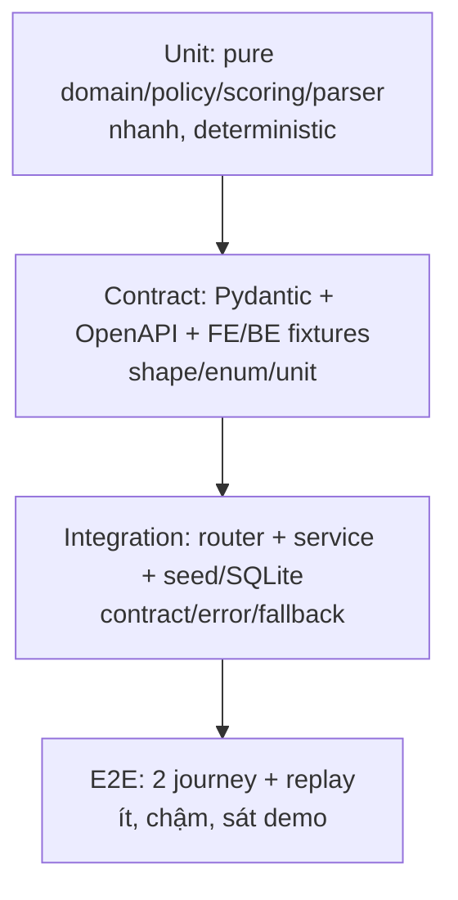
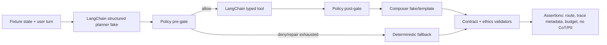

# TESTING — chiến lược kiểm thử CareerCompass

> Source of truth cho test layout, markers, CI gates và evidence bàn giao. Threshold
> chất lượng AI/data vẫn nằm ở `EVALUATION.md`; file này quy định **test ở đâu và chạy thế nào**.

## 1. Test pyramid cho hackathon 48h



Nguyên tắc: lỗi business rule phải được bắt ở unit; lỗi shape bắt ở contract; lỗi
wiring bắt ở integration; E2E chỉ chứng minh journey quan trọng, không lặp mọi edge case.
Không test CSS/API plumbing bằng model live.

## 2. Cấu trúc chuẩn

```text
backend/
├── pytest.ini
└── tests/
    ├── conftest.py                 # fixture dùng chung, không network
    ├── unit/                       # pure functions/models/policy
    ├── contract/                   # API/OpenAPI/schema/fixture parity
    ├── integration/                # FastAPI + service + local storage/seed
    ├── e2e/                        # Explore, Launch, replay journeys
    └── fixtures/                   # fictional/sanitized/versioned artifacts
        ├── agent/                  # PR-12/14: allow|deny|fallback|injection|personas|replay
        ├── profiler/               # PR-02 transcript fixtures
        └── market/                 # M2/M3 golden records
```

Frontend test folders chỉ được thêm khi F1/F2 có component behavior cần bảo vệ:
`frontend/tests/unit`, `frontend/tests/contract`, `frontend/tests/e2e`. Không thêm test
framework FE trong lúc P0 đang đỏ; TypeScript + build + backend contract fixtures là gate nền.

**Cập nhật (F1):** `frontend/tests/unit` đã có 64 test thật (Vitest + Testing Library) bảo
vệ chat state machine, profile diff/patch, và các component chat/profile — chạy bằng
`npm run test` trong `frontend/`, đã lên CI (`.github/workflows/ci.yml`) như một gate bắt buộc.
`transparency-copy.test.ts` (M6/PR-09) là ngoại lệ: script `assert` chạy qua `npx tsx`, không
phải Vitest suite — bị exclude khỏi `vitest.config.ts`, không chạy trong bước `npm run test`.

## 3. Markers và network policy

| Marker | Được dùng | Không được dùng | CI |
|---|---|---|---|
| `unit` | model, parser, policy, scorer, merge | HTTP, DB thật, model provider | mỗi PR |
| `contract` | Pydantic/OpenAPI/fixture parity | business flow dài | mỗi PR |
| `integration` | TestClient, seed, temp SQLite, gateway fake | internet/model live | mỗi PR |
| `e2e` | fictional persona/replay full journey | PII, secret, mặc định model live | release gate |

Mọi model/tool call trong test mặc định phải fake ở ranh giới `services/llm.py`. Live tests
nếu thật sự cần phải có marker riêng trong PR task, explicit env opt-in, budget owner và
không chạy trong CI mặc định.

## 4. Lệnh chuẩn

Từ `backend/`:

```bash
python -m pip install -r requirements.txt -r ../data/requirements.txt
python -m compileall app scripts tests
python -m pytest -q tests/unit tests/contract
python -m pytest -q tests/integration
python -m pytest -q tests/e2e
python -m scripts.check_routes
```

Targeted task examples:

```bash
python -m pytest -q tests/unit/test_profile_contract.py
python -m pytest -q tests/contract/test_schema_contract.py
python -m pytest -q tests/integration/test_api_smoke.py
```

`pytest.ini` bật `--strict-markers`; marker sai tên làm test fail thay vì bị bỏ qua âm thầm.

## 5. Coverage theo module và owner

| Module/task | Unit bắt buộc | Integration/contract bắt buộc | Owner |
|---|---|---|---|
| D-04 normalize | salary/date/region/dedupe edge cases | fixture hai source cùng schema | M2 |
| MI-02/03 extraction | alias/negation/normalization | golden set + cache/resume | M3 |
| MI-04 stats | percentile/null/confidence/trend | snapshot hash + API values | M3 |
| PR-03 profiler | completeness/merge/correction precedence | 10 turns hai mode + delete/restart | M4 |
| PR-05 matching | weights/cap/diversity/stretch | persona + region invariants | M4 |
| PR-12 policy/tools | stage allowlist, args, privacy, budget | LangChain tool schema + graph compile/invoke | M4 |
| PR-13 graph | node routing/deadline/fallback | `/api/chat` deterministic/agent parity | M4/M1 |
| PR-14 red-team | tool-selection fixtures, injection, 12 personas, provenance, budget/replay | scorecard writeback `EVALUATION_RESULTS.md` | M4 |
| API contract | model/OpenAPI fields/enums/units | FE fixture/API smoke | endpoint owner/M1 |
| Demo | — | Explore + Launch + replay E2E ba lần | M1 |

## 6. Agent test graph



Test graph không gọi provider. Planner/composer fake trả structured objects; tool dùng fixture
đã sanitize; clock/deadline được inject. Mỗi stage cần ít nhất một allow, deny, invalid args,
timeout và exception fixture. Recommendation tests xác nhận không có planner call.

## 7. CI và release gates

```text
compile → unit → contract → integration → route invariant → FE typecheck/build
                                              ↓
                              CI: E2E Explore/LangGraph + Launch/replay
```

- PR không được merge nếu unit/contract/integration hoặc FE build đỏ.
- E2E thật nằm ở `tests/e2e/test_journeys.py`, dùng TestClient + SQLite local và cấm network/provider.
- Test flaky được coi là fail: fix clock/random/network dependency, không rerun đến xanh rồi bỏ qua.
- Không giảm threshold trong `EVALUATION.md` để hợp kết quả.
- Mọi handoff ghi command, output PASS/FAIL/NOT_RUN, commit và limitation. `NOT_RUN` không phải DONE.

## 8. Fixture governance

Fixture agent/data có metadata khi liên quan:

```json
{
  "contract_version": "v1",
  "prompt_version": "profiler-v1",
  "tool_policy_version": "agent-policy-v1",
  "snapshot_hash": "seed-or-real-sha256",
  "fictional": true
}
```

Không commit transcript học sinh thật, raw profile, API key hoặc chain-of-thought. Replay chỉ lưu
input/output public đã sanitize, tool name, policy reason code, latency giả lập/version hashes.

