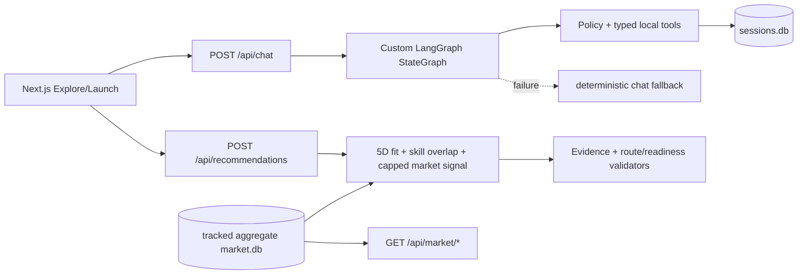

# HANDOFF — Release integrity v2

## Outcome

Release path được chốt: Next.js gọi FastAPI thật; `/api/chat` dùng bounded LangGraph; recommendation/pathway/readiness deterministic; SQLite aggregate `market.db` được đóng gói cùng backend; raw/full text không phát hành trong Git HEAD.

## Runtime graph



## Changed contracts and invariants

- Public API shape không đổi.
- Release `AGENT_MODE=langgraph`; kill switch `deterministic`; network/provider kill switch `DEMO_MODE=replay`.
- Recommendation never invokes an agent planner.
- Fit cosine only compares named five-dimension vectors in the same space.
- A career absent from a valid real snapshot returns zero/low-confidence, never seed demand.
- Every recommendation has at least two routes and one non-university route; autonomy disclaimer remains mandatory.

## Data artifact

- `backend/market.db`: 43 career rows, 548 skill rows, 16 meta rows; aggregate columns only, no description.
- `data/processed/manifest.json`: mapping 89/298 (29,87%), permission unverified, extraction caveats.
- Raw, processed full text and auto-labeled gold remain available locally but are ignored and removed from Git HEAD.
- This change does not rewrite Git history. If the repository has already been public, M1 should rotate/recreate the repository or perform a separately approved history-clean operation only if policy/legal review requires it.

## Run

```bash
# backend (Python 3.11)
cd backend
python -m pip install -r requirements.txt
python -m uvicorn app.main:app --reload --port 8000

# frontend (Node 20)
cd frontend
npm install
npm run dev
```

Local ignored env is configured for `market.db`, `sessions.db`, `AGENT_MODE=langgraph`, API `http://localhost:8000`, and `NEXT_PUBLIC_USE_MOCK=0`. Secrets were not changed.

## Verify

```bash
cd backend
python -m compileall app scripts tests
python -m pytest -q tests/unit tests/contract
python -m pytest -q tests/integration
python -m pytest -q tests/e2e
python -m scripts.check_routes

cd ../frontend
npm run typecheck
npm run test
npm run build
```

Expected health: `status=ok`, `market_db_loaded=true`, `postings_count=298`.

## Current evidence and remaining handoff

- Baseline `99f463e`: backend CI 285 tests PASS; frontend 61 tests/typecheck/build PASS.
- Current branch local: Python 3.11.9; 262 unit+contract, 29 integration, 2 E2E, route 25/25, AI imports and compile PASS; frontend 61 tests, typecheck and production build PASS. CI is still authoritative after push.
- M1 must fill deploy URLs, current commit and smoke evidence in `docs/PREFLIGHT.md`.
- Human extraction accuracy, dual-rater recommendation quality and student/counselor usefulness remain `NOT_RUN`.
