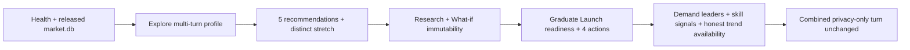

# HANDOFF — Release workflow completion

Status: **AUTOMATED CORE PASS · PRODUCTION/HUMAN GATES NOT PASSED**

- Product-code evidence: `2fc677ee2997d9884fd1b97991d8754542f31043`
- CI evidence: [GitHub Actions 29660149913](https://github.com/MRXz194/TitanHack_Careercompass/actions/runs/29660149913)
- Runtime artifact: `runtime-workflow-2fc677ee2997d9884fd1b97991d8754542f31043`
- Contract: `docs/API_CONTRACT.md`
- Runbook: `docs/TESTING.md` §10

## 1. Những gì đã khóa

- Privacy-only turn, kể cả tên + giới tính + email + điện thoại + key giả trong cùng một câu,
  không tăng turn/phase/completeness và không persist profile evidence.
- Recommendation, What-if và Career Research từ chối profile trống bằng `409`; không tạo kết
  quả “cá nhân hóa” generic.
- Region query dùng enum contract và trả envelope `422` cho giá trị lạ.
- Health tách `llm_configured` khỏi provider readiness; legacy `llm_ok` chỉ là alias.
- Market tách `demand_leaders` (volume một cửa sổ) khỏi `rising_careers` (chỉ khi đủ dữ liệu
  thời gian). Không gọi “nhiều tin” là “đang tăng”.
- PostCSS của Next được override lên `8.5.19`; production dependency audit trả 0 vulnerability.

## 2. Workflow đã chạy qua FastAPI thật



`python -m scripts.show_workflow_pipeline --output workflow-pipeline.json` chạy với
`AGENT_MODE=deterministic`, `WEB_RESEARCH_MODE=off`, provider keys rỗng, session DB tạm và
released `market.db`. Gate fail-fast kiểm tra:

- market artifact được nạp và có posting;
- top-5 duy nhất, stretch nằm ngoài top-5, mỗi nghề có ít nhất hai route và một route ngoài
  đại học;
- Research giữ provenance state hợp lệ; What-if không đổi hồ sơ hay core order;
- Launch không bịa project/Python đã bị người dùng phủ định và luôn có bốn action 30 ngày;
- demand/skill signals có dữ liệu, còn trend được báo availability riêng;
- privacy-only turn giữ nguyên turn, phase và profile.

Report/artifact chỉ có count, ID và boolean aggregate; không có raw chat, profile, secret hoặc
chain-of-thought. CI vẫn upload report khi gate fail để lỗi không biến mất trong log.

## 3. Verification matrix

| Gate | Kết quả |
|---|---|
| Python compile + pinned LangChain/LangGraph imports | PASS CI Ubuntu/Python 3.11 |
| Backend unit/contract | 335 PASS |
| Backend integration | 46 PASS |
| Backend E2E | 7 PASS |
| Runtime workflow + route invariant | PASS |
| Frontend Vitest | 81/81 PASS local + CI Node 20 |
| TypeScript + Next 15.5.20 production build | PASS local + CI |
| `npm audit --omit=dev` | 0 vulnerability |

## 4. Cách verify lại

```bash
cd backend
python -m compileall app scripts tests
python -m pytest -q tests/unit tests/contract
python -m pytest -q tests/integration
python -m pytest -q tests/e2e
python -m scripts.show_workflow_pipeline --output workflow-pipeline.json
python -m scripts.check_routes

cd ../frontend
npm install
npm run test
npm run typecheck
npm run build
npm audit --omit=dev
```

## 5. Không được claim PASS

- Vercel production vẫn cần tắt Deployment Protection và chạy incognito route smoke.
- Render URL thật/CORS/cold-start/provider smoke chưa có credential/URL evidence.
- Mapping candidate D3 chưa được phát hành vì held-out mapping accuracy chưa chạy và vùng
  `other` còn quá lớn; release vẫn dùng aggregate đã duyệt.
- DDG live gate mới 7/10 nên production/demo giữ `WEB_RESEARCH_MODE=replay`.
- Student/counselor usability test chưa có participant evidence.
- FPT credential từng được chia sẻ ngoài secret manager phải rotate/revoke trước deploy; không có
  key thật nào được đưa vào commit này.

Người nhận chỉ tick production-ready sau khi hoàn tất đúng các gate trên và cập nhật
`docs/next/RELEASE_SCORECARD.md` + `docs/DEPLOY.md` bằng URL/commit/timestamp thật.
