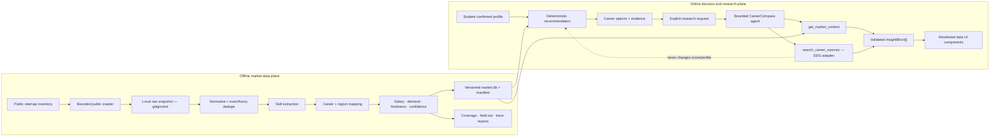
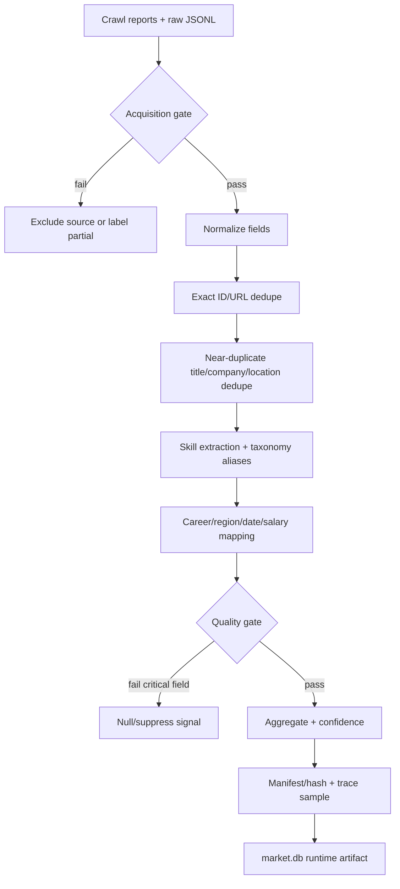
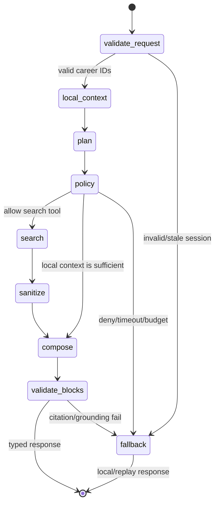
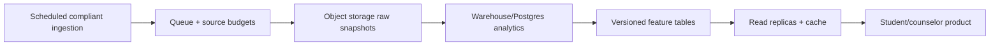

# Day 3 — Data, Career Research và Dynamic Insight Architecture

Tài liệu này là implementation reference cho phần data analysis, web research và UI insight của `Opportunity Decision Lab`. Nó chỉ có hiệu lực sau Expansion Gate trong `README.md`; không thay đổi authority boundary của MVP: recommendation, score, stretch, readiness và route vẫn do code deterministic kiểm soát.

Data quality/Signal/Compare/What-if là P0-D3. Web Research ở mục 4 là P1, chỉ mở sau H+17; việc mô tả đầy đủ ở đây không phải quyền tự động triển khai trước gate.

## 1. Quyết định kiến trúc

### 1.1 Hai data plane, một ranh giới authority



- Offline artifacts quyết định market statistics. Không crawl trong request của user.
- Web research chỉ chạy khi user bấm/tạo intent sau khi đã có recommendation.
- Web result không được ghi profile, sửa candidate set, score, readiness hoặc routes.
- LLM không sinh raw HTML/React. Nó chỉ chọn tool và compose dữ liệu vào schema block đã validate; frontend map block type sang component allowlist.

### 1.2 Vì sao chưa dùng vector database

Không thêm vector DB trong Day 3:

- career KB hiện nhỏ và candidate retrieval đã có embedding artifact/version hash;
- market query là aggregate/filter theo career, skill, region, thời gian — SQLite phù hợp và dễ replay;
- web search là dữ liệu ngắn hạn có citation, không phải long-term semantic corpus;
- thêm service mới làm tăng deploy, migration, secret và failure surface mà không tăng điểm judge tương xứng.

Chỉ mở ADR vector DB sau hackathon khi có trên khoảng 10.000 tài liệu dài cần semantic retrieval, multi-tenant access control, incremental indexing và measured latency/recall cho thấy NumPy/SQLite không còn đủ.

## 2. Snapshot acquisition contract

### 2.1 Quy tắc crawler

| Rule | Enforcement | Evidence |
|---|---|---|
| Chỉ URL công khai từ sitemap | source adapter không nhận cookie/login token | crawler unit test + source report |
| Không vượt CAPTCHA/403/429 | dừng source ngay và ghi `blocked`, `stop_reason` | report JSON |
| Cap theo record hợp lệ, không theo số URL thử | `--limit` là usable unique records | `requested_limit`, `attempted_urls`, `unique_records` |
| Rate có kiểm soát | random delay, timeout và bounded retry | CLI config + log |
| Resume không tải lại prefix đã xử lý | high-water sitemap offset + stable URL/ID | resume test |
| Raw text không commit/release | `data/raw` gitignored; chỉ release aggregate | secret/git status check |
| Không tạo duplicate để đạt quota | unique stable ID và canonical URL | QA report |

Target phải hiểu là **tối đa số record công khai đang hoạt động**, không phải quota bằng mọi giá:

- VietnamWorks: tối đa 3.000 record hợp lệ từ public sitemap.
- ITviec: tối đa 3.000, nhưng nếu public inventory thấp hơn thì lấy toàn bộ inventory unique và ghi limitation.
- TopCV: tối đa 1.000; gặp 403/429 thì dừng, không bypass và không claim nguồn này đại diện.

Command mẫu chạy từ repo root, không truyền cookie/key:

```powershell
# Canary bắt buộc trước full crawl
python data/pipeline/crawl_jobs.py --source vietnamworks --canary --limit 3
python data/pipeline/crawl_jobs.py --source itviec --canary --limit 3
python data/pipeline/crawl_jobs.py --source topcv --canary --limit 3

# Full/resume; cap là usable unique records
python data/pipeline/crawl_jobs.py --source vietnamworks --limit 3000 --resume --min-delay 1 --max-delay 1
python data/pipeline/crawl_jobs.py --source itviec --limit 3000 --resume --min-delay 1 --max-delay 1
python data/pipeline/crawl_jobs.py --source topcv --limit 1000 --resume --min-delay 2 --max-delay 3

# Parser/resume regression
cd backend
python -m pytest tests/unit/test_public_crawler.py -q
```

Nếu canary/full report ghi `blocked=true`, không retry liên tục trong cùng session. Owner ghi limitation và chuyển nguồn sang `partial/excluded` theo quality gate.

### 2.2 Raw schema

```json
{
  "id": "stable-source-id",
  "source": "vietnamworks | itviec | topcv",
  "url": "https://public-job-url",
  "title": "...",
  "company": "...",
  "region_raw": "...",
  "salary_raw": "...",
  "experience_raw": "...",
  "posted_date_raw": "...",
  "description": "...",
  "skills": ["..."],
  "crawled_at": "ISO-8601"
}
```

Raw schema là ingestion boundary, không phải API response. Company/title/description chỉ dùng offline; runtime UI dùng aggregate và source metadata trừ khi terms/source review cho phép link public cụ thể.

## 3. Data analysis workflow và quality gates



### 3.1 Required profiling metrics

M2 phải xuất report theo từng source và toàn snapshot:

- records discovered/attempted/usable; stop reason và block status;
- unique ID, unique URL, exact duplicate và near-duplicate rate;
- coverage của title, region, posted date, salary, experience, description và explicit skills;
- parse failure theo adapter/reason, không chỉ tổng failure;
- distribution theo region/career family và tỷ lệ unmapped;
- salary parse success, currency/unit normalization, outlier/suppression count;
- posted-date parse success và freshness buckets;
- top skills trước/sau alias normalization;
- snapshot hash, taxonomy hash, career-KB hash và pipeline commit.

Manifest handoff tối thiểu:

```json
{
  "snapshot_id": "jobs-YYYYMMDD-<short-hash>",
  "captured_at": "ISO-8601",
  "pipeline_commit": "git-sha",
  "inputs": [
    {"source": "itviec", "records": 0, "sha256": "...", "status": "complete|partial|excluded", "stop_reason": "..."}
  ],
  "taxonomy_sha256": "...",
  "career_kb_sha256": "...",
  "outputs": {"market_db_sha256": "...", "trace_report_sha256": "..."},
  "quality": {
    "exact_duplicates": 0,
    "near_duplicates": 0,
    "salary_valid_coverage": 0.0,
    "region_valid_coverage": 0.0,
    "posted_date_valid_coverage": 0.0,
    "career_mapping_coverage": 0.0
  },
  "limitations": []
}
```

Các số `0` là schema example, không phải kết quả snapshot. Build fail nếu hash/input/output thiếu; consumer không được tự tìm “file mới nhất” theo mtime.

### 3.2 Claim boundary từ dữ liệu tuyển dụng

Source-specific blockers đã quan sát trong acquisition run:

| Source/field | Vấn đề | Publish rule |
|---|---|---|
| ITviec `baseSalary` | JSON-LD có thể chứa marketing copy thay vì số | parser chỉ nhận numeric; existing invalid value → null/“thỏa thuận”, không tính salary sample |
| VietnamWorks `locations` | payload có location ID số | chỉ hiển thị region sau khi map bằng versioned lookup và spot-check; nếu không thì suppress region |
| TopCV date/source | partial 28 records rồi HTTP 403; date tập trung một ngày | label partial, không dùng riêng nguồn này để suy trend/representation |

M2/M3 phải giải quyết bằng normalization + tests; “field không rỗng” không được tính là field valid.

ITviec là nguồn chuyên IT còn VietnamWorks rộng hơn; source mix không phải mẫu ngẫu nhiên của toàn thị trường lao động Việt Nam. Signal Inspector phải hiển thị count theo source và confidence/source-diversity, không cộng dồn rồi diễn giải chênh lệch source coverage như chênh lệch nhu cầu thật.

| Có thể nói | Không được nói nếu chỉ có job postings |
|---|---|
| “Kỹ năng X xuất hiện nhiều trong snapshot tuyển dụng quan sát được.” | “Kỹ năng X chắc chắn đang thiếu nhân lực.” |
| “Nhu cầu quan sát được tập trung ở các vùng...” | “Em ở vùng khác thì không nên theo nghề này.” |
| “Mức lương đăng tuyển có median... trên n mẫu công khai.” | “Em sẽ nhận được mức lương này.” |
| “Tỷ lệ tin mới trong cửa sổ quan sát...” | “Nghề sẽ tăng trưởng trong tương lai.” |

Một snapshot đơn chỉ cho biết observed demand/freshness. Chỉ hiển thị trend khi có ít nhất hai window có đủ sample và cùng pipeline definition. “Shortage” cần thêm dữ liệu supply (graduates, available workers hoặc employer time-to-fill) nên nằm ngoài claim của Day 3.

### 3.3 Confidence rules

```text
high   = sample đủ + field coverage đạt + >=2 source hợp lệ + mapping ổn định
medium = sample đủ nhưng một source hoặc một coverage dimension yếu
low    = sample nhỏ, chỉ một source, date/salary coverage thấp hoặc mapping uncertainty cao
hidden = không đạt privacy/license/minimum sample hoặc không tái tạo được
```

Không hard-code “high” theo một threshold duy nhất. Service tính từ sample, source diversity, field coverage, freshness và mapping coverage; response phải kèm reason codes để Signal Inspector giải thích.

## 4. CareerCompass web-research extension

### 4.1 Product boundary

Tên capability: **Career Research Cards**. Nó trả lời “Em muốn kiểm tra thêm thông tin hiện tại về hướng này” sau khi user chọn một hoặc hai option. Đây là source discovery/grounded context, không phải web-powered ranking.

[`ddgs`](https://pypi.org/project/ddgs/) là adapter miễn phí, không cần API key, nhưng là package cộng đồng (PyPI ghi rõ mục đích educational) và không phải full-search API chính thức của DuckDuckGo. Vì vậy:

- pin `ddgs==9.14.4` trong spike, gọi `backend="duckduckgo"` rõ ràng;
- `WEB_RESEARCH_MODE=off|replay|ddg`, production mặc định `off` đến khi smoke pass;
- timeout 4 giây/search, tối đa 1 search tool call/request, tối đa 5 results;
- cache theo normalized query trong 30 phút; không cache profile/chat text;
- nếu rate-limit/error: trả local market context + replay/curated source list, không 5xx;
- không proxy, không CAPTCHA bypass, không arbitrary page crawl trong user request.

### 4.2 Agent stage và allowlist

Thêm `research` stage chỉ cho endpoint/intention sau recommendation:

| Stage | Agent-selectable tools | Cấm |
|---|---|---|
| `research` | `get_market_context`, `search_career_sources` | profile write, ranking, readiness mutation, generic URL fetch, shell/browser |

Input phải chứa `career_ids` thuộc recommendation hiện tại và một intent allowlist:

```python
class CareerResearchRequest(BaseModel):
    session_id: str
    career_ids: list[str]  # 1..2, must belong to current result
    intent: Literal["overview", "required_skills", "study_routes", "local_market"]
    region: str | None = None

class SearchCareerSourcesInput(BaseModel):
    career_titles: list[str]
    intent: ResearchIntent
    region: str | None = None
```

Query do code builder tạo từ canonical career title/intent/region; không nối nguyên văn user message vào search. Policy strip name, gender, school, GPA, contact data và prompt-like instructions.

### 4.3 Result trust model

```python
class ResearchSource(BaseModel):
    title: str
    url: HttpUrl
    domain: str
    snippet: str
    source_tier: Literal["official", "industry", "general"]
    published_at: date | None
    retrieved_at: datetime

class CareerResearchResult(BaseModel):
    career_id: str
    local_market: MarketStats
    sources: list[ResearchSource]
    limitations: list[str]
    search_status: Literal["live", "cached", "replay", "unavailable"]
```

- Search result/snippet là untrusted input: sanitize HTML, length limit, URL scheme/domain safety, reject localhost/private-network/redirect anomalies.
- Prompt instruction trong title/snippet không bao giờ đổi tool scope.
- Mọi con số thị trường trong summary phải đến từ `MarketStats`; web result được trình bày như nguồn để đọc thêm, không tự biến thành statistic.
- Source tier chỉ là heuristic provenance, không phải chứng nhận đúng/sai. UI luôn có link, domain, ngày truy xuất và limitation.

### 4.4 Bounded research graph



Tái sử dụng LangChain model gateway, LangGraph `StateGraph`, registry, policy reason code và trace format hiện tại. Không thêm agent framework, multi-agent hoặc memory mới.

## 5. Dynamic Insight UI — không phải plain-text chat

Frontend không render prose dài. Backend trả `InsightBlock[]` discriminated union; agent có thể chọn thứ tự/block phù hợp nhưng không thể tạo component tùy ý:

```ts
type InsightBlock =
  | { type: "market_metric"; label: string; value: number | null; unit: string; confidence: Confidence; sourceRef: string }
  | { type: "skill_table"; rows: SkillSignalRow[]; snapshotId: string }
  | { type: "route_timeline"; routes: Route[]; limitations: string[] }
  | { type: "comparison"; left: CompareOption; right: CompareOption }
  | { type: "source_cards"; sources: ResearchSource[]; status: SearchStatus }
  | { type: "caveat"; severity: "info" | "warning"; text: string };
```

Component allowlist:

- `MarketSignalStrip`: demand sample, salary coverage, freshness, confidence.
- `SkillDemandTable`: skill, posting share/count, source/sample, confidence.
- `CareerCompareMatrix`: evidence, market, route, uncertainty, next step với visual weight bằng nhau.
- `WhatIfDelta`: before/after, added/removed/reordered options và undo/confirm.
- `RouteTimeline`: vocational/certificate/college/university routes; không bịa cost/duration.
- `ResearchSourceGrid`: domain, title, snippet ngắn, source tier, retrieved date và external-link warning.
- `EvidenceDrawer`: snapshot/hash/source/date/limitation cho judge/counselor.

Visual direction dùng Cream Paper, Schematic Blue, Ink Black, Signal Orange; serif cho nội dung đọc và mono cho UI/data. Không copy login/pricing/marketing sections từ reference vì không phục vụ flow học sinh. Orange chỉ cho một CTA chính trong mỗi cluster; source/limitation không được giấu vì lý do thẩm mỹ.

## 6. Target folder layout

Tên cuối cùng phải theo convention hiện có và được N1 review; không tạo module song song nếu service tương đương đã tồn tại.

```text
backend/
  app/
    models/
      agent_schemas.py            # extend with research/tool contracts
    routers/
      research.py                 # thin HTTP boundary
    services/
      agent_graph.py              # extend existing graph with bounded research stage
      agent_policy.py             # extend allowlist/privacy/budget/URL rules
      agent_tools.py              # register typed search tool
      research_search.py          # DDG adapter + cache + replay gateway
      market.py                   # existing aggregate-only context
    data/replay/research/          # sanitized deterministic fixtures
  tests/
    unit/
      test_research_policy.py
      test_research_search.py
      test_public_crawler.py
    contract/test_research_contract.py
    integration/test_research_flow.py

frontend/
  components/insights/
    InsightRenderer.tsx
    MarketSignalStrip.tsx
    SkillDemandTable.tsx
    CareerCompareMatrix.tsx
    ResearchSourceGrid.tsx
    EvidenceDrawer.tsx
  lib/api.ts                      # only HTTP client boundary
  types/index.ts                  # contract parity
  __tests__/insights/             # component/state fixtures

data/
  pipeline/
    crawl_jobs.py
    normalize.py
    extract_skills.py
    map_careers.py
    build_market_stats.py
  raw/                            # local only, gitignored
  processed/                      # reports/manifests; raw enriched text ignored

docs/next/
  DATA_SNAPSHOT_AUDIT.md          # sanitized counts/hashes/limitations
  RELEASE_SCORECARD.md            # created at H+0
```

Router không gọi DDG/LLM trực tiếp; component không tự tính confidence/market statistic; test fixture không chứa secret, session cookie hoặc licensed raw description.

## 7. API, storage và deploy

### P0 reuse

- FastAPI + Pydantic contract.
- SQLite `market.db` read-only ở runtime; JSON/YAML career KB; NumPy embedding artifact nếu retrieval cần.
- Next.js typed API client và fixture parity.
- LangChain + LangGraph hiện có; FPT-compatible LLM gateway hiện có.

### D3 additions

- `POST /api/research/careers` hoặc contract tương đương sau N1 review.
- `ddgs==9.14.4` là optional dependency/extra, không ảnh hưởng deterministic/replay boot.
- TTL cache in-process cho search results; không lưu raw profile/query dài hạn.
- Render env: `WEB_RESEARCH_MODE`, timeout/result cap; không cần secret DDG.

| Env | Default | Production rule |
|---|---|---|
| `WEB_RESEARCH_MODE` | `off` | chỉ `ddg` sau N4-05/N1 sign-off; `replay` cho demo ổn định |
| `WEB_RESEARCH_TIMEOUT_SECONDS` | `4` | hard cap, không để model/search kéo dài request vô hạn |
| `WEB_RESEARCH_MAX_RESULTS` | `5` | 1–5; UI không nhận list không giới hạn |
| `WEB_RESEARCH_CACHE_TTL_SECONDS` | `1800` | cache normalized query/result, không cache raw chat/profile |
| `MARKET_SNAPSHOT_ID` | bắt buộc ở release | phải khớp manifest/hash đang deploy |

Render/Vercel health check không gọi DDG. App phải boot và core E2E phải pass khi `WEB_RESEARCH_MODE=off`; frontend chỉ hiện live CTA khi backend capability/status cho phép.

### Scale later, không làm trong 24h



Scale gate cần legal/source agreements, data retention policy, monitoring, incremental snapshots và supply-side datasets. Không gọi MVP là “real-time”; dùng “time-stamped labor-market snapshot”.

## 8. Test strategy và failure matrix

| Layer | Must test | Failure response |
|---|---|---|
| Crawler unit | sitemap, three parsers, stable ID, resume, limit | source report records failure |
| Canary | 3 public URLs/source, schema/description threshold | không mở full crawl |
| Snapshot QA | unique, coverage, dedupe, mapping, salary/date | suppress/exclude source/field |
| Extraction eval | fixed held-out precision/recall/F1 và slices | giữ baseline nếu không tăng |
| Agent policy | stage allowlist, tool budget, prohibited attributes | deny + local fallback |
| Search adapter | timeout, empty, malformed URL, rate-limit | cached/replay/unavailable |
| Prompt injection | instructions trong user/snippet | tool scope/output không đổi |
| Grounding | mọi market number có sourceRef/snapshot | block block/response invalid |
| Contract | Pydantic↔TS↔mock/replay parity | không merge |
| E2E | Result→Research→Source→Compare/What-if | feature flag off nếu fail |

## 9. Definition of done cho increment này

- Snapshot có machine-readable reports, hashes, coverage và limitation theo từng source; raw không nằm trong git.
- Runtime artifact tái tạo được từ cùng snapshot/taxonomy/KB/commit.
- Judge có thể đi từ một market number trên UI tới source, sample, snapshot và confidence.
- Nếu P1 Career Research được bật, nó chỉ chạy sau explicit intent, có citation/link/status và không đổi recommendation/profile.
- Nếu P1 được bật, agent/search timeout hoặc bị chặn vẫn trả local/replay response hợp contract, không 5xx.
- UI hiển thị structured blocks, mobile/keyboard/accessibility pass và không có unsupported numeric claim.
- Core regression, route opportunity, paired-bias, grounding, secret scan, frontend build và backend tests đều xanh tại release commit.
