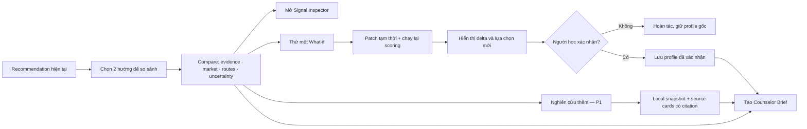
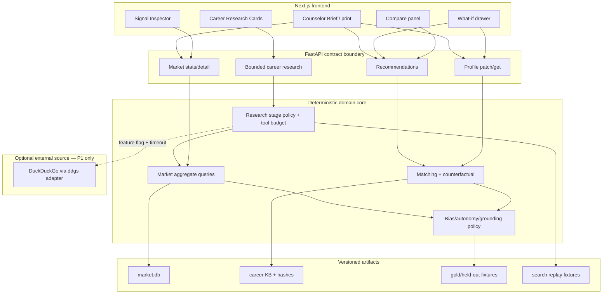

# DAY 3 PLAN — Opportunity Decision Lab (extra 24h)

## 1. Goal và lý do chọn hướng này

MVP hiện đã trả lời “em có những hướng nào và vì sao”. Ngày dư tập trung trả lời bốn câu hỏi thực tế hơn:

1. **Tín hiệu này đáng tin đến đâu?** — source, sample, salary coverage, confidence và thời gian snapshot phải nhìn thấy được.
2. **Hai hướng khác nhau ở đâu?** — người học cần so sánh evidence, thị trường, route, constraint và uncertainty thay vì nhìn một ranking đơn.
3. **Nếu em thay đổi một điều thì sao?** — counterfactual phải chạy lại scoring thật, giúp mở rộng agency thay vì đóng khung profile hiện tại.
4. **Em có thể tự kiểm chứng ở đâu?** — nguồn web hiện tại phải xuất hiện dưới dạng card có citation/status/limitation, không phải một đoạn LLM nói trơn và không được âm thầm đổi ranking.

Đây là lát cắt tăng điểm trực tiếp:

| Tiêu chí chấm | Nâng cấp ngày dư | Bằng chứng judge nhìn thấy |
|---|---|---|
| Skill-signal extraction | Signal Inspector + error analysis | precision/recall/F1, sample/confidence, source/date, trace aggregate |
| Personalization/explainability | Compare + what-if | hai career cards cùng factors, delta trước/sau, evidence source |
| Anti-bias/opportunity expansion | alternatives, constraint-aware what-if, paired tests | không top-1 verdict; region/gender invariants; non-university routes |
| Student/counselor usefulness | Counselor Brief + observed usability test | task completion, time, usefulness quote, print artifact |
| Current-source verification | bounded Career Research Cards | nguồn/link/ngày truy xuất, live/replay status, search không ảnh hưởng score |

### Business decision được hỗ trợ

| Người dùng | Quyết định thực tế | CareerCompass hỗ trợ | Không thay người dùng quyết định |
|---|---|---|---|
| Học sinh chưa rõ hướng | chọn 2–3 hướng đáng tìm hiểu và một hoạt động thử trong 2 tuần | evidence profile, market snapshot, route đa dạng, source cards | không chọn ngành/trường thay học sinh |
| Sinh viên sắp ra trường | ưu tiên skill gap và deliverable cho một entry role | observed demand, readiness evidence, project/action plan | không dự đoán xác suất được tuyển |
| Counselor/trung tâm nghề nghiệp | chuẩn bị câu hỏi và so sánh lựa chọn trong buổi tư vấn | Signal Inspector, Compare, Counselor Brief | không tự động ra quyết định/case management |
| Nhà trường ở bước scale | nhận biết nhóm skill được tuyển dụng nhắc nhiều để rà chương trình | aggregate theo thời gian/vùng với confidence | không gọi demand là shortage nếu thiếu supply data |

Day 3 ưu tiên student/counselor flow. Dashboard nhà trường, cohort analytics và workflow doanh nghiệp là scale-later vì cần RBAC, consent, retention và dữ liệu đại diện hơn.

## 2. Scope

### P0-D3 — phải hoàn thành

- Signal Inspector cho một career/skill đang hiển thị: snapshot, sources, posting count, region, trend confidence, salary sample/coverage và top co-skills.
- Compare tối đa 2 careers/entry roles từ recommendation hiện tại.
- So sánh theo đúng các field đã grounded: personal evidence, market signal, routes, readiness (Launch), uncertainty và first step.
- What-if với tối đa một thay đổi mỗi lần: thêm skill có evidence giả định, thay interest/dimension hoặc thay constraint; gọi profile patch/recommendation core hiện có và hiển thị delta.
- Nút hoàn tác; original profile không bị ghi đè nếu người dùng chưa xác nhận.
- Counselor Brief dạng HTML/print gồm profile do user xác nhận, 2 options, evidence, questions to discuss, routes và source/limitations.
- E2E, paired-bias, grounding và usability evidence cho capability mới.

### P1-D3 — làm nếu P0-D3 pass trước H+16

- “Skill bridge”: một skill có thể mở thêm những career family nào, dựa trên KB + observed market co-occurrence.
- Compare một route university với một route vocational/certificate theo thời gian/bước đầu; không tự bịa học phí hoặc tỷ lệ việc làm.
- Chế độ counselor presentation: ẩn raw chat, chỉ hiển thị user-confirmed evidence và câu hỏi cần thảo luận.
- Một vòng cải thiện taxonomy/extractor dựa trên confusion analysis, với metric before/after trên held-out set.
- Career Research Cards đầy đủ: typed contract + replay/local fallback trước, sau đó mới bật live DuckDuckGo adapter nếu spike pass. Chỉ nhận 1–2 career IDs thuộc recommendation; `ddgs==9.14.4`, backend DuckDuckGo, timeout/result budget/cache/feature flag; không fetch URL tùy ý và không dùng web để scoring.

### P2-D3 — chỉ làm nếu còn ít nhất 3 giờ sau release candidate

- Polish animation nhỏ cho score delta.
- Export JSON đã sanitize ngoài HTML print.
- Thêm một insight visualization co-skill; phải có accessible table fallback.

### Out of scope

- Crawler scheduler “real-time”, Kafka/queue, Postgres/vector DB migration.
- Counselor account/dashboard, RBAC, cohort analytics hoặc lưu brief trên server.
- Vacancy-level matching, CV scoring, auto-apply, employer ranking.
- Học phí, tỷ lệ có việc, dự báo lương hoặc “nghề thiếu nhân lực” khi không có nguồn phù hợp.
- Thêm model/provider/framework agent mới; recommendation không đi qua agent planner. Day 3 chỉ tái sử dụng LangChain/LangGraph, registry và policy hiện có cho stage `research` bị giới hạn.
- Generic browser/deep crawler trong request, proxy/CAPTCHA bypass, web result tự ghi profile hoặc tự tạo market statistic.
- Thay đổi scoring weights chỉ để làm demo đẹp.

## 3. Product flow

## 4. Architecture increment

Không tạo microservice, vector database hoặc agent framework mới. Capability mới là lớp presenter và một research branch bị giới hạn trên core/runtime hiện có. Thiết kế chi tiết nằm ở `DATA_RESEARCH_ARCHITECTURE.md`.

### Contract strategy

Ưu tiên tái sử dụng contract hiện có:

- Compare ghép hai `Recommendation` đã trả về; không cần endpoint ranking mới.
- What-if dùng `PATCH /profile` trên một working copy và gọi recommendation hiện có. Nếu API chưa hỗ trợ preview, bổ sung `preview=true` hoặc endpoint preview chỉ sau contract-change process; không âm thầm ghi đè session.
- Signal Inspector dùng market/career detail hiện có. Chỉ thêm field khi thật sự thiếu `sample_size`, `confidence`, `snapshot_id` hoặc provenance; cập nhật API contract, Pydantic, TS và mock trong cùng PR.
- Brief được render phía frontend từ response đã có; không lưu server và không cần thư viện PDF.
- Research dùng endpoint/intent riêng sau recommendation. Agent validate career IDs thuộc result hiện tại; chỉ `get_market_context` và `search_career_sources` nằm trong allowlist. Mọi field mới phải có Pydantic↔TypeScript↔mock/replay parity.

### Data and privacy

- Không hiển thị raw job descriptions hoặc company-level examples nếu source terms không cho phép.
- Brief không chứa raw transcript, session token, chain-of-thought hoặc agent trace.
- Tên người học để trống mặc định; nếu user nhập thì chỉ nằm trong DOM/print client-side.
- What-if state tồn tại trong memory; refresh sẽ mất trừ khi user xác nhận patch.
- Search query được code tạo từ canonical career/intent/region, không chứa tên, gender, school, GPA hoặc raw transcript. Search cache không lưu profile và web result không đi vào market DB.

### Data baseline và analysis gate

- Crawl theo public inventory, cap usable records và dừng an toàn khi source block; không dùng cookie/session/proxy.
- Raw snapshot gitignored. Chỉ aggregate, manifest, coverage/error report và sanitized trace được phép commit/release.
- Trước khi mở UI, M2/M3 phải chốt duplicate rate, field coverage, salary/date parse, career/region mapping, held-out extraction và snapshot/taxonomy/KB hashes.
- Job postings chỉ chứng minh observed demand. “Shortage” và “future growth” không được claim nếu chưa có supply data hoặc đủ time windows.

## 5. Timeline 24 giờ

| Mốc | Mục tiêu | Exit gate |
|---|---|---|
| H+0–1 | Expansion Gate + freeze baseline | M1 ghi commit, test evidence, owner, scope |
| H+1–3 | Contract/UX/data design | sample JSON + wireframe + research boundary sketch; no breaking ambiguity |
| H+3–8 | Parallel build A: signal; B: compare; C: what-if/brief | unit/component/fixture tests từng nhánh |
| H+8 | Integration checkpoint 1 | Compare dùng mock + inspector dùng snapshot thật |
| H+8–12 | Live core integration + contract parity | FE mock/live parity, profile preview an toàn |
| H+12–15 | Bias/grounding/data trace tests | tất cả hard invariants pass |
| H+15–17 | E2E Explore + Launch + replay | 3 flow P0-D3 pass; không Sev-1/2 |
| H+17 | P1/live-search go/no-go | chỉ mở Research/DDG/P1 nếu release candidate xanh; spike/replay phải pass trước live |
| H+17–20 | P1 có gate hoặc user/counselor fix | không chạy hai hướng; M1 chọn theo impact/risk |
| H+20–22 | Pitch integration, screenshots, claim audit | demo story ≤4 phút, mọi claim có evidence |
| H+22–24 | Freeze, rehearsal, rollback rehearsal | 2 rehearsal pass; fallback một thao tác |

## 6. Kill switches

Cut order khi trễ: P2 polish → live DDG → N3-03/route-compare P1 → Counselor Brief polish (giữ print HTML tối thiểu) → live What-if (giữ read-only fixture). Không cắt core regression/ethics, snapshot provenance, Signal Inspector tối thiểu hoặc Compare tối thiểu để cứu feature phụ.

- H+3 chưa chốt preview semantics → What-if chỉ chạy client-side trên fixtures/counterfactual hiện có; không sửa profile thật.
- H+8 inspector chưa có market provenance thật → giữ confidence/source panel hiện tại, cắt co-skill visualization.
- H+12 contract parity fail → compare chỉ dùng fields hiện có; không merge contract expansion.
- DDG spike gặp rate-limit/terms/latency hoặc citation fail → giữ `WEB_RESEARCH_MODE=replay|off`; Research Cards chỉ dùng local context/curated fixtures.
- H+15 paired-bias hoặc grounding fail → tắt What-if khỏi demo và giữ Compare read-only.
- H+17 E2E chưa xanh → dừng P1/P2, sửa reliability và replay.
- User/counselor không hiểu delta trong 30 giây → đổi về bảng “Giống / Khác / Điều cần hỏi thêm”, cắt chart.

## 7. Demo story sau mở rộng

1. Người học hoàn tất hội thoại; profile live có thể sửa.
2. Hệ thống đưa nhiều lựa chọn, gồm stretch và route ngoài đại học.
3. Chọn hai hướng khác nhau để so sánh trên cùng personal/market evidence.
4. Mở Signal Inspector để xem số tin, vùng, thời gian, confidence và limitation.
5. Bấm “Nghiên cứu thêm”; agent trả local signal và source cards có link/ngày truy xuất, không đổi thứ tự hai hướng.
6. Thử thêm một skill/constraint trong What-if; hệ thống chạy lại scoring và giải thích delta.
7. Người học hoàn tác hoặc xác nhận; quyền quyết định vẫn thuộc về họ.
8. In Counselor Brief để biến output thành đầu vào cho buổi tư vấn thật.

## 8. Definition of success

Ngày dư thành công khi có **một câu chuyện tích hợp mạnh hơn**, không phải nhiều feature hơn:

- Judge truy được một market claim từ UI về snapshot/source/sample/confidence.
- User mở được nguồn nghiên cứu hiện tại; live/search lỗi vẫn có local/replay response và recommendation không đổi.
- Người test so sánh được 2 hướng và giải thích ít nhất 1 khác biệt mà không cần người hướng dẫn.
- What-if tạo delta bằng scoring thật và hoàn tác không làm đổi profile gốc.
- Compare luôn có ít nhất một route non-university khi data career hỗ trợ invariant hiện tại.
- Gender/school text không đổi candidate set/readiness; region không hard-filter.
- Counselor đánh giá brief đủ dùng làm điểm mở đầu thảo luận, dù có thể cần chỉnh thêm.
