# Persona & Workflow Hardening — release plan

> Mục tiêu: biến lỗi quan sát khi đóng vai người dùng thành release gates có thể lặp lại.
> Đây là P0/P1 hardening của core hackathon, không phải mở thêm feature. Branch thực thi:
> `codex/persona-workflow-hardening`.

## 1. Kết luận audit

Hiện tượng “nhiều học sinh ra kết quả giống nhau” không đến từ một lỗi đơn lẻ:

| ID | Severity | Root cause | Ảnh hưởng người dùng | Trạng thái candidate |
|---|---|---|---|---|
| PH-01 | Sev-1 | UUID session cũ được tái dùng; opening `null` từng rewind phase nhưng giữ profile | Persona sau mang dữ liệu persona trước | Đã sửa + test |
| PH-02 | Sev-1 | Mock recommendations cố định, không đọc câu trả lời | Mọi user demo nhận cùng danh sách | Đã sửa + test |
| PH-03 | Sev-2 | LangGraph extraction `reply_hint` ghi đè câu trả lời adaptive | Có LLM nhưng chat vẫn giống script | Đã sửa + test |
| PH-04 | Sev-2 | Keyword substring + bỏ dấu làm `về→vẽ`, `đây→dạy`, `hạn→hàn`; negation yếu | Profile sai, giảm khác biệt persona | Đã sửa + regression |
| PH-05 | Sev-2 | “chưa có project/thực tập” vẫn có thể tạo experience | Readiness và explanation bịa evidence | Đã sửa + regression |
| PH-06 | Sev-2 | Interest ngắn bất kỳ (`lớp 12`, `gần nhà`) bị lưu như sở thích | Noise giống nhau ở mọi profile | Đã sửa + regression |
| PH-07 | Sev-2 | Evidence dùng skill đầu tiên giải thích mọi career | Explanation plausible nhưng sai | Đã sửa + regression |
| PH-08 | Sev-2 | Profile trống vẫn nhận market-led list dưới nhãn cá nhân hóa | Overclaim/giảm niềm tin | Trả 409; mock từ chối |
| PH-09 | Sev-2 | Landing lưu mode nhưng `/explore` server default Explore | Graduate Launch mở sai journey | Đã sửa + build |
| PH-10 | Sev-2 | Response cũ có thể thắng response mới khi đổi mode/reset | UI/profile nhảy ngược session | Epoch guard + component test |
| PH-11 | Sev-2 | Research luôn dùng `region=all`; Decision Lab nằm sau list dài | Chức năng “địa phương” và verify khó thấy | Đã sửa + test/UI QA |
| PH-12 | Sev-2 | Không xóa được interest; mock/FE/BE patch không đồng nhất | Vi phạm autonomy/correction | Contract 3 nơi + test |
| PH-13 | Sev-1 release | Vercel redirect sang login nhưng từng được ghi HTTP 200 | Judge không mở được sản phẩm | Chưa sửa dashboard; runbook/scorecard đã chặn |
| PH-14 | Sev-1 verification | Backend host/Python không có trên máy audit | Không thể gọi local backend/pytest | Đã thay bằng CI Ubuntu 388 tests + runtime workflow artifact; local limitation còn nhưng automated gate đã pass |
| PH-15 | Sev-1 | Correction tool serialize field không được gửi thành `null` | Xóa một interest có thể xóa/lock luôn job goal và education | Đã sửa `exclude_unset` + test |
| PH-16 | Sev-2 | Launch mock gắn dashboard/Excel project cố định vào readiness | User chưa có project vẫn thấy evidence bịa | Readiness dựng từ profile thật + regression |
| PH-17 | Sev-2 privacy | Turn chỉ có tên/giới/contact vẫn được persist và tăng phase | Thu PII không cần thiết, completeness tăng giả | Strip + no-progress gate + test |
| PH-18 | Sev-2 | Mock lưu profile nhưng không lưu phase/turn | Refresh ghép profile cũ với opening script mới | Runtime resume idempotent + test |
| PH-19 | Sev-2 UX | Launch readiness nằm sau hai thao tác mở card → chọn tab | User tưởng kế hoạch 30 ngày chưa tồn tại | Summary luôn thấy + CTA mở thẳng + component/browser test |
| PH-20 | Sev-1 integration | Helper privacy từng bị chèn giữa `_compact_interest_label`, khiến nhánh trích sở thích nằm sau `return` và không thể chạy | Profile thiếu interest nên persona lại hội tụ dù chat vẫn phản hồi | Khôi phục parser, giữ privacy gate tách biệt + regression từ `test_quality_tuning.py` |

Không được gọi release “ready” chỉ vì frontend build xanh. PH-13 và PH-14 là external/manual
gates còn mở.

## 2. Luồng chuẩn sau hardening

```mermaid
flowchart LR
  U["User chọn Explore / Launch"] --> N["FE tạo UUID mới"]
  N --> C["POST /api/chat opening"]
  C --> S["Load canonical session"]
  S --> R{"AGENT_MODE=langgraph + key?"}
  R -->|yes| P["LangChain AgentPlan\nchọn đúng 1 typed tool"]
  R -->|no/replay| D["Deterministic safe extract"]
  P --> G["Policy pre/post gate"]
  G --> T["LangGraph tool node"]
  T --> M["Merge evidence + user corrections"]
  D --> M
  M --> Q["Adaptive structured reply\nhoặc question-bank fallback"]
  Q --> V["Visible/editable Profile"]
  V --> E{"Có personal evidence?"}
  E -->|no| C
  E -->|yes| X["Deterministic matching"]
  X --> O["Top 5 + stretch + non-uni routes"]
  O --> L["Decision Lab: compare / research / what-if"]
  L --> I["Profile & core ranking immutable"]
```



Authority không đổi: agent chọn tool thu thập/sửa evidence; code quyết định phase, merge,
score, stretch, route, readiness, number grounding và anti-bias. Web research không quay lại
scoring.

## 3. Persona acceptance matrix

### 3.1 Explore — signal-rich

| Persona | Evidence tối thiểu | Dominant expected | Expected family trong top-3 |
|---|---|---|---|
| Kỹ thuật thực hành | sửa quạt, lắp ráp máy móc, hàn dây | `ky_thuat` | điện lạnh/CNC/ô tô/điện/mạng |
| Phân tích | data, Excel, SQL, dashboard, logic | `phan_tich` | data/kế toán/QA/web |
| Sáng tạo | vẽ, design, content, photo/video | `sang_tao` | design/content/media/marketing |
| Xã hội | dạy, chăm sóc, tình nguyện, tư vấn | `xa_hoi` | nursing/care/teaching/advising |
| Tổ chức | event, lịch, điều phối, kinh doanh | `quan_ly` | logistics/admin/HR/hospitality |

Gate toàn nhóm: `>=4/5` top-1 khác nhau; cả 5 top-3 tuple khác nhau; mỗi result có 5 ID
không trùng; stretch ngoài top-5; mọi option có >=2 routes và >=1 route
`vocational|college|certificate`.

### 3.2 Graduate Launch

| Persona | Must capture | Must not infer | Result check |
|---|---|---|---|
| Data project | final-year + goal + Excel/SQL + dashboard output | level cao hơn lời user | readiness có matched evidence + 4 deliverables |
| Creative portfolio | recent graduate + Figma/Photoshop + portfolio | trường/GPA là skill | creative family + evidence quote |
| No experience | explicit no project/intern + foundation tool | project/Python giả | `experiences=[]`, honest build-foundation/near-ready |

### 3.3 Paired ethics

- Cùng evidence, chỉ đổi “em là nam/nữ” → same candidate order/readiness.
- Cùng evidence, chỉ đổi Hà Nội/Đà Nẵng → candidate universe không co lại; region chỉ là context.
- Cùng evidence, thêm school prestige/GPA → same score/readiness.
- Budget hạn chế có thể đổi route emphasis, không loại nghề.
- Mọi profile không persist gender/contact/API key; user correction luôn thắng inference.

## 4. Edge-case inventory bắt buộc

| Layer | Cases |
|---|---|
| Input | dấu/không dấu, emoji, multiline, whitespace, 1–2 từ, >2k chars, HTML/markdown, prompt injection |
| Semantic | không biết/chưa biết/không còn thích; phủ định A nhưng khẳng định B; đổi ý nhiều lần; activity vs consumption |
| Homograph | về/vẽ, đây/dạy, hạn/hàn, sữa/sửa, điện thoại/điện kỹ thuật |
| Launch evidence | no project, coursework, volunteer, internship, output không có link, tool chỉ “đã nghe” |
| Session | first open, refresh/resume, two tabs, restart, mode switch, request race, expired/deleted session |
| API | timeout, 404, 409 blank profile, 422 invalid patch/what-if, 500 envelope, CORS, cold start |
| Results | null salary, low confidence, no trend, long Vietnamese, duplicate career, missing source, no research links |
| Decision tools | 0/1/2 selection, region switch, research timeout, malicious URL/snippet, what-if undo, repeated click |
| Privacy | tên thật, email, VN phone formats, pasted API key, gender/GPA/school, privacy-only turn, raw transcript/log/trace scan |
| Accessibility | 390px DOM overflow, keyboard, focus-visible, reduced motion, screen-reader labels, print |

## 5. Work breakdown cho 6 thành viên

Mỗi owner chỉ sửa lane của mình sau khi rebase hardening candidate; review chéo, không cùng sửa
một file. Trạng thái `VERIFIED` cần reviewer chạy command, không chỉ đọc code.

### M1 — Integration / release owner

**PH-M1-01 — CI truth gate**

- Xử lý: chạy toàn bộ backend compile/unit/contract/integration/e2e trên Ubuntu; frontend
  test → typecheck → build tuần tự; không chạy typecheck song song với build vì `.next/types` race.
- Expected: log số test, commit SHA, Python/Node versions, no-network env.
- Verify: current branch GitHub Actions; `git diff --check`; secret scan.
- DoD: tất cả xanh; nếu persona distinctness fail, mở bug với actual top-5 từng persona.
- Handoff: CI URL + SHA → M4/M5/M6.

**PH-M1-02 — Public deployment truth**

- Xử lý: tắt Vercel Deployment Protection production; nhận Render URL thật; set exact CORS;
  set `AGENT_MODE=langgraph`, `CHAT_TIMEOUT_SECONDS=12`, research replay.
- Expected: incognito không login redirect; `/api/health` market DB true; Explore/Launch live.
- Verify: final URL, redirect chain, 6 routes, CORS, cold start, mock kill-switch drill.
- DoD: public smoke pass 3 lần; rollback deployment ID được ghi.

**PH-M1-03 — Human acceptance**

- Xử lý: 2 Explore + 2 Launch + 1 counselor; không hướng dẫn đáp án; ghi blocker/time/quote ẩn danh.
- Expected: task completion denominators + ít nhất một fix quan sát thật.
- DoD: không Sev-1/2; counselor tìm được source/route/trade-off <=60s.

### M2 — Data trace / local reality

**PH-M2-01 — Persona-to-market spot check**

- Xử lý: với top-3 của 5 persona, trace demand/salary/skill/source về aggregate/manifest;
  kiểm tra region `hanoi|hcm|danang|other` và low-confidence/null rules.
- Expected: 15-row sanitized audit table, snapshot/hash, mismatch list.
- Tests: no raw job text commit; salary sample <5 null; no trend claim khi confidence thấp.
- DoD: 15/15 displayed numbers trace được hoặc UI suppress đúng.
- Handoff: IDs/source notes/caveats → M3/M6.

### M3 — Matching / data quality

**PH-M3-01 — Distinctness and stability review**

- Xử lý: chạy 5 persona + paired region/gender; inspect score components, không tune bằng cảm giác.
- Expected: table cosine/skill/market component cho top-5; explain shared results nếu hợp lý.
- Tests: market cap; deterministic tie-break; candidate universe; KB route invariant.
- DoD: distinctness gate pass; không đổi weight nếu chưa có held-out evidence.
- Handoff: score report → M4/M1.

### M4 — AI/profile/recommendation owner

**PH-M4-01 — Agent + profiler verification**

- Xử lý: verify live planner chọn correction/extract/inspect/ask; provider failure fallback;
  no-accent/negation/no-experience/correction/privacy/session tests; agent chỉ chọn tool,
  correction args do code dựng từ current turn/profile và field không gửi không được serialize `null`.
- Expected: sanitized tool trace metadata, không CoT/raw transcript; planner args code-owned.
- Tests: targeted unit + integration + `test_persona_workflows.py`; live opt-in 10 fictional turns
  với quota owner, không chạy mặc định CI.
- DoD: no 5xx; tool outside stage denied; extracted evidence và reply không ghi đè nhau.
- Handoff: test output + known provider limits → M5/M1.

**PH-M4-02 — Explanation integrity**

- Xử lý: mỗi `from_you` phải là direct skill/interest/dimension relation hoặc honest weak-signal;
  blank profile 409; number grounding.
- DoD: không dùng skill đầu tiên giải thích career không liên quan; 100% route/evidence invariants.

### M5 — Explore UX owner

**PH-M5-01 — Session UX and race sweep**

- Xử lý: landing mode/new UUID, live + mock resume, restart confirmation, mode switch, stale
  response, patch rollback, retry/reset failure, mock badge, mock Launch evidence parity, mobile
  drawer không che composer.
- Tests: component deferred-promise race; API reset; 390px keyboard/focus; offline/cold start.
- DoD: hai persona liên tiếp không share profile; refresh không rewind; no horizontal overflow.
- Handoff: screen recording Explore+Launch + state matrix → M1/M6.

### M6 — Results/Market UX owner

**PH-M6-01 — Feature discoverability**

- Xử lý: compare/research/what-if nằm trước long cards; jump nav; region selector; result
  error retry/new profile; Launch readiness summary hiện khi card đóng và mở thẳng 30-day plan;
  fallback labeling; score copy không phải verdict.
- Tests: 0/1/2 options, all regions, source empty/error, what-if undo, profile immutable,
  mobile/print/long text/null/low confidence.
- DoD: first viewport chỉ rõ Compare & Verify; user tìm source/confidence <=20s.
- Handoff: screenshots + Vitest/build output → M1.

## 6. Merge workflow

```text
1. M4 backend targeted review/tests
2. M5 Explore targeted review/tests
3. M6 Results targeted review/tests
4. M2/M3 data + score audit (không đổi artifact nếu gate chưa pass)
5. M1 full CI → branch review → merge
6. Render/Vercel deploy → incognito smoke
7. Human test → one observed fix → final freeze
```

Rules:

- Contract change = docs + Pydantic + TypeScript + mock + tests cùng commit.
- Không commit `.env`, raw transcript, raw postings, browser profile hoặc screenshot có secret.
- Không `audit fix --force`, không thêm Vector DB/agent framework/data source trong hardening lane.
- Test failure phải sửa root cause; không giảm distinctness/fairness/grounding threshold để xanh.
- Handoff dùng `docs/HANDOFF.md`; `NOT_RUN` không được đổi thành PASS.

## 7. Verification commands

Backend (máy có Python):

```bash
cd backend
python -m compileall app scripts tests
python -m pytest -q tests/unit tests/contract
python -m pytest -q tests/integration
python -m pytest -q tests/e2e/test_journeys.py tests/e2e/test_persona_workflows.py
python -m scripts.check_routes
```

Frontend, chạy tuần tự:

```bash
cd frontend
npm ci
npm run test
npm run typecheck
npm run build
```

Deploy:

```text
GET <render>/api/health
Open <vercel>/ in incognito (no auth redirect)
Explore persona technical → new profile → creative persona → rankings differ
Launch no-experience → no invented project/Python
Results → region research → what-if → undo → profile unchanged
```

## 8. Scope lock và scale sau release

In-scope: profiling correctness, bounded LangChain/LangGraph tool selection, deterministic
personalization, evidence integrity, session/privacy, feature discoverability, deploy truth.

Out-of-scope P0: CV scoring, job auto-apply, counselor dashboard/account, vector DB, autonomous
crawler in request, multi-agent, open-ended ReAct loop, school ranking, hiring probability.

Nếu hoàn thiện sớm và toàn bộ manual gate đã pass, thứ tự scale:

1. Held-out annotation theo persona/language region để đo extraction F1 thật.
2. Add explicit user confirmation before profile becomes recommendation-ready.
3. Session TTL + durable production DB/Redis, rate limit và telemetry không PII.
4. More Vietnamese career families/routes reviewed by counselor.
5. Same-model embedding retrieval chỉ sau offline evaluation; chưa cần Vector DB ở KB nhỏ.
6. Live DDG chỉ khi fresh 10-query gate >=8/10; vẫn không đổi score/profile.

## 9. Current verification truth

- Frontend unit/persona/race/privacy/discoverability/market-semantics tests: **81/81 PASS local và CI**.
- Frontend typecheck + production build: PASS local.
- Desktop happy-path visual: PASS automated; 390px emulated DOM `scrollWidth == innerWidth`.
- Backend compile + **335 unit/contract + 46 integration + 7 E2E = 388 tests + runtime workflow + route invariant: PASS CI Ubuntu** ([run 29660149913](https://github.com/MRXz194/TitanHack_Careercompass/actions/runs/29660149913)); Python vẫn không có local.
- Render live API/CORS: NOT RUN, URL chưa được bàn giao.
- Vercel public access: FAIL, đang bị deployment authentication.
- Human student/counselor: NOT RUN.

Release status: **automated hardening verified, chưa final-ready** cho tới khi ba gate manual
Render/Vercel/human được cập nhật bằng evidence thật.
