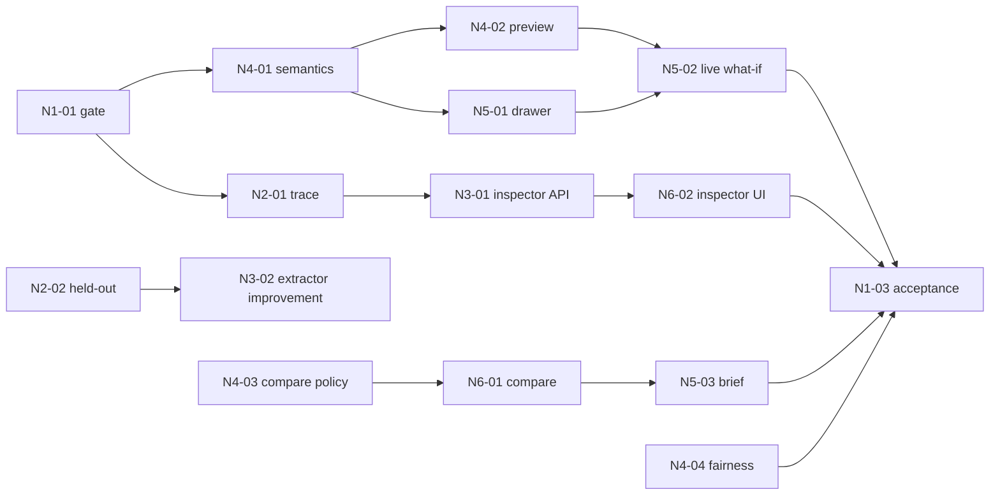

# DAY 3 TASKS — Breakdown M1–M6

## 0. Rule chung

Mỗi task chỉ `DONE` khi có đủ: artifact, test command/output, commit, limitation, consumer acknowledgement. Task không áp dụng phải ghi `NOT_APPLICABLE` cùng lý do. Mọi thay đổi contract phải cập nhật `docs/API_CONTRACT.md`, Pydantic, TypeScript và mock trong cùng PR.

Nhánh đề xuất: `feat/<TASK-ID>-slug`. Prefix task ngày dư: `N1`…`N6` theo owner.

## M1 — Integration, release và evidence

### N1-01 — Expansion Gate và baseline freeze (H+0–1)

- **Problem:** mở feature khi core chưa ổn sẽ làm mất demo.
- **Actions:** chạy test matrix; ghi commit baseline; xác nhận data snapshot, replay, Sev-1/2, owner và rollback; đóng băng contract cũ.
- **Expected:** `docs/next/RELEASE_SCORECARD.md` được tạo từ template trong `EVALUATION.md`.
- **Tests:** backend unit/contract/integration; FE typecheck/build; Explore/Launch/replay smoke.
- **DoD:** mọi gate trong `README.md` pass hoặc kế hoạch ngày dư bị hủy.
- **Risk/fallback:** bất kỳ P0 fail → M1 chuyển toàn team về core bug list.
- **Handoff:** baseline commit + commands → M2–M6.

### N1-02 — Contract/integration control (H+1–15)

- **Problem:** compare/what-if/provenance dễ tạo field lệch FE–BE.
- **Actions:** review sample payload; quản lý contract change; merge theo thứ tự M3/M4 → M5/M6; smoke sau mỗi merge.
- **Expected:** contract diff nhỏ, mock/live/replay parity.
- **Tests:** OpenAPI/Pydantic/TS fixture parity; error/null/low-confidence cases.
- **DoD:** không consumer nào tự suy đoán field; main xanh sau từng merge.
- **Fallback:** cắt field mới và dùng presentation từ contract hiện có.
- **Handoff:** integration status mỗi checkpoint H+8/H+12/H+15.

### N1-03 — Acceptance, user test và release (H+15–24)

- **Actions:** chạy 3 E2E; điều phối 2 sinh viên Explore, 2 Launch và 1–2 counselor; ưu tiên 1 fix dựa trên quan sát; claim audit; rehearsal/rollback.
- **Expected:** scorecard thật, screenshot/video backup, demo script cập nhật.
- **Tests:** tasks U1–U5 trong `EVALUATION.md`; ngắt model/network và bật replay.
- **DoD:** không Sev-1/2, 2 rehearsal pass, mọi metric ghi đúng sample size.
- **Fallback:** feature fail bị ẩn bằng feature flag; demo core cũ.
- **Handoff:** release commit + known limitations → presenter.

## M2 — Data traceability và held-out quality

### N2-01 — Snapshot trace pack (H+1–6)

- **Problem:** aggregate đẹp nhưng judge không thấy đường từ source tới signal.
- **Actions:** khóa snapshot ID/hash; report count theo source/region/time; salary coverage; dedupe/unmapped; chọn 10 aggregate và truy ngược posting IDs nội bộ.
- **Expected:** machine-readable manifest + sanitized trace fixture; không commit raw licensed text.
- **Tests:** schema/hash reproducibility; 10/10 aggregate trace; source URL/date present.
- **DoD:** M3 tái tạo đúng count; M6 render được source/sample/confidence.
- **Fallback:** chỉ expose source/count/date; bỏ trace-level UI nếu terms không cho phép.
- **Handoff:** snapshot/version/caveats → M3, M6, M1.

### N2-02 — Held-out annotation và error taxonomy (H+6–12)

- **Problem:** F1 chung không cho biết extractor sai ở tiếng Việt, alias hay nghề nào.
- **Actions:** rà ít nhất 40 postings held-out cân bằng vùng/nhóm nghề; tag false positive/negative theo nguyên nhân; không dùng set này để tune trước baseline.
- **Expected:** error matrix: alias, negation, requirement-vs-nice-to-have, tool/version, soft skill ambiguity, title mapping.
- **Tests:** reviewer agreement trên 10 mẫu chồng lặp; không PII/raw text trái license trong repo.
- **DoD:** M3 nhận top 3 lỗi có impact và baseline metrics.
- **Fallback:** 20 mẫu nếu thời gian thiếu; ưu tiên non-IT/vocational và negation.
- **Handoff:** held-out report → N3-02.

### N2-03 — Route reality check (H+12–16)

- **Actions:** spot-check route/first step cho 10 careers, ưu tiên vocational/non-IT; kiểm tra không có học phí/thời lượng/cam kết việc làm vô nguồn.
- **Expected:** route QA report và correction PR nhỏ nếu cần.
- **Tests:** route invariant + source/claim lint thủ công hai reviewer.
- **DoD:** 10/10 career pass hoặc bad route bị ẩn.
- **Handoff:** verified routes → M4/M6.

## M3 — Market AI và Signal Inspector backend

### N3-01 — Signal Inspector query model (H+1–7)

- **Problem:** API market cần đủ evidence để giải thích confidence.
- **Actions:** expose hoặc chuẩn hóa snapshot/source/sample/salary coverage/trend confidence/top co-skills từ aggregate hiện có; không scan raw JSON per request.
- **Expected:** typed service + fixture/API response cho career/skill detail.
- **Tests:** empty region; sample thấp; salary n<5→null; trend thiếu window→low confidence; provenance bắt buộc.
- **DoD:** M6 render được inspector mà không tự tính số.
- **Fallback:** trả subset source/count/date/confidence từ `meta` và stats hiện có.
- **Handoff:** sample request/response + snapshot hash → M6/M1.

### N3-02 — Extractor error-driven improvement (H+7–14)

- **Problem:** ngày dư chỉ đáng dùng để tune AI nếu metric held-out tăng thật.
- **Actions:** chạy baseline trên N2-02; chọn tối đa 2 thay đổi taxonomy/rule/prompt; chạy lại fixed held-out; lưu before/after và regressions.
- **Expected:** confusion report, cost/latency và artifact version mới nếu có improvement.
- **Tests:** precision/recall/F1 micro; non-IT slice; negation slice; malformed structured output fallback.
- **DoD:** merge khi precision không giảm quá 0.01 và F1 hoặc critical slice tăng; nếu không, giữ baseline và ghi học được gì.
- **Fallback:** không merge tuning; dùng report như evidence trung thực.
- **Handoff:** metrics + taxonomy/model/hash → M1/M4.

### N3-03 — Skill bridge computation (P1, H+17–20)

- **Actions:** từ career KB + co-occurrence đã aggregate, trả careers liên quan đến một skill; threshold/sample/confidence rõ.
- **Tests:** không career ngoài KB; region không hard-filter; low sample suppressed; deterministic ordering.
- **DoD:** M6 có thể nói “skill này xuất hiện ở các nhóm nghề…” mà không gọi đó là đảm bảo cơ hội.
- **Fallback:** cắt P1, không ảnh hưởng inspector.

## M4 — Counterfactual, policy và explainability

### N4-01 — What-if domain contract (H+1–4)

- **Problem:** preview không được ghi đè profile hoặc cho LLM tự quyết định ranking.
- **Actions:** định nghĩa allowed mutations, working-copy semantics, max one mutation, undo/confirm; chốt output delta.
- **Expected:** design fixture cho add/remove skill, interest/dimension và constraint.
- **Tests:** forbidden gender/school/GPA mutation; invalid value; profile original unchanged.
- **DoD:** M1/M5 xác nhận semantics trước khi code UI.
- **Fallback:** chỉ dùng counterfactual hiện có read-only.
- **Handoff:** fixture + policy matrix → M5/M6.

### N4-02 — Deterministic preview + delta (H+4–10)

- **Actions:** clone validated profile; áp mutation; chạy matching/pathway core; tính added/removed/reordered options và factor deltas; LLM chỉ phrasing từ validated delta nếu dùng.
- **Expected:** service/endpoint hoặc adapter theo quyết định contract; undo không persistence, confirm mới patch.
- **Tests:** deterministic same input; no mutation leak; number grounding; region/gender/school invariance; route invariant; timeout fallback.
- **DoD:** 8 fixtures Explore/Launch pass; original session unchanged sau preview.
- **Fallback:** template explanation; không gọi LLM.
- **Handoff:** API/fixture/test evidence → M5/M6/M1.

### N4-03 — Compare explanation policy (H+8–13)

- **Actions:** tạo factors chung để compare: user evidence, observed market, routes, constraints, uncertainty, next step; không gắn nhãn winner/best.
- **Expected:** compare view-model hoặc deterministic selector; câu hỏi counselor gợi mở.
- **Tests:** missing/low-confidence/null salary; no top-1 verdict; every digit grounded; stretch retained.
- **DoD:** M6 không cần tạo explanation riêng trong component.
- **Handoff:** copy/fixtures → M6.

### N4-04 — Expanded fairness/red-team (H+12–16)

- **Actions:** paired test what-if/compare cho gender wording, school prestige, region, budget constraint và stereotype prompt injection.
- **Expected:** audit appendix có failure/fix thật.
- **Tests:** candidate set/readiness tolerance; region never filters; budget changes route emphasis but không xóa toàn bộ options; tool allowlist unchanged.
- **DoD:** 100% hard invariants pass; fail thì disable what-if.
- **Handoff:** pass/fail + claim boundary → M1.

## M5 — What-if UX và profile autonomy

### N5-01 — What-if drawer trên mock (H+2–7)

- **Problem:** user phải hiểu đây là thử giả định, không phải sửa hồ sơ ngay.
- **Actions:** mutation selector, current/preview state, “Thử thay đổi”, “Hoàn tác”, “Xác nhận cập nhật”; chỉ một mutation; natural Vietnamese copy.
- **Expected:** responsive component dùng fixture N4-01.
- **Tests:** keyboard/focus; loading/error; duplicate click; invalid mutation; mobile; undo.
- **DoD:** user phân biệt preview với saved profile trong usability dry-run.
- **Fallback:** read-only preset counterfactual card.
- **Handoff:** state matrix/screenshots → M4/M6/M1.

### N5-02 — Live preview integration (H+8–13)

- **Actions:** gọi API qua `lib/api.ts`; mock/live/replay cùng shape; optimistic UI chỉ cho preview; confirm mới patch.
- **Tests:** timeout/retry; 404 session; server validation; refresh; confirm/undo; original profile unchanged on failure.
- **DoD:** Explore và Launch preview chạy; không raw error/trace.
- **Fallback:** feature flag tắt live preview, giữ preset demo.
- **Handoff:** integrated flow → M1/M6.

### N5-03 — Counselor Brief shell/print (H+10–16)

- **Actions:** print layout từ confirmed profile + selected options; source/limitations; discussion questions; clear-before-print; không raw chat.
- **Tests:** print preview A4; long Vietnamese; null data; no session ID/API key/raw transcript; local-only name.
- **DoD:** counselor tìm được evidence, alternatives và next questions trong ≤60 giây.
- **Fallback:** browser print của structured HTML, không PDF library.
- **Handoff:** print artifact → M1 user test/M6 visual review.

## M6 — Compare, Signal Inspector và demo surface

### N6-01 — Compare 2 options (H+2–8)

- **Problem:** ranking list dễ khiến user hiểu top-1 là verdict.
- **Actions:** select tối đa 2; bảng compare factors; equal visual weight; route types; low-confidence; CTA what-if/brief.
- **Expected:** mock implementation cho Explore/Launch; accessible mobile stack.
- **Tests:** 0/1/2 selection; stretch; null salary/readiness; keyboard; long text; non-university route visible.
- **DoD:** không có “winner/best”; user nói lại được ít nhất một trade-off.
- **Fallback:** stacked cards không chart.
- **Handoff:** selected IDs/state → M5 Brief và M1.

### N6-02 — Signal Inspector UI (H+6–12)

- **Actions:** panel source/date/count/sample/confidence/coverage/co-skills; plain-language tooltip giải thích observed demand; accessible table fallback.
- **Tests:** low confidence; n<5 salary; missing trend; mixed sources; mobile; source note always visible.
- **DoD:** judge truy được một số về snapshot metadata trong ≤20 giây.
- **Fallback:** compact provenance panel; bỏ chart/co-skills.
- **Handoff:** screenshots + data-state matrix → M1.

### N6-03 — Live integration và pitch polish (H+12–20)

- **Actions:** wire N3/N4; verify mock/live/replay; refine hierarchy; capture screenshots; update 60-second narrative.
- **Tests:** FE typecheck/build; E2E Compare→Inspector→What-if→Brief; contrast/keyboard/mobile.
- **DoD:** no layout shift/blocker; source/limitation không bị giấu; demo ≤4 phút.
- **Fallback:** feature flags tắt từng phần độc lập.
- **Handoff:** release UI → M1.

## Dependency graph

