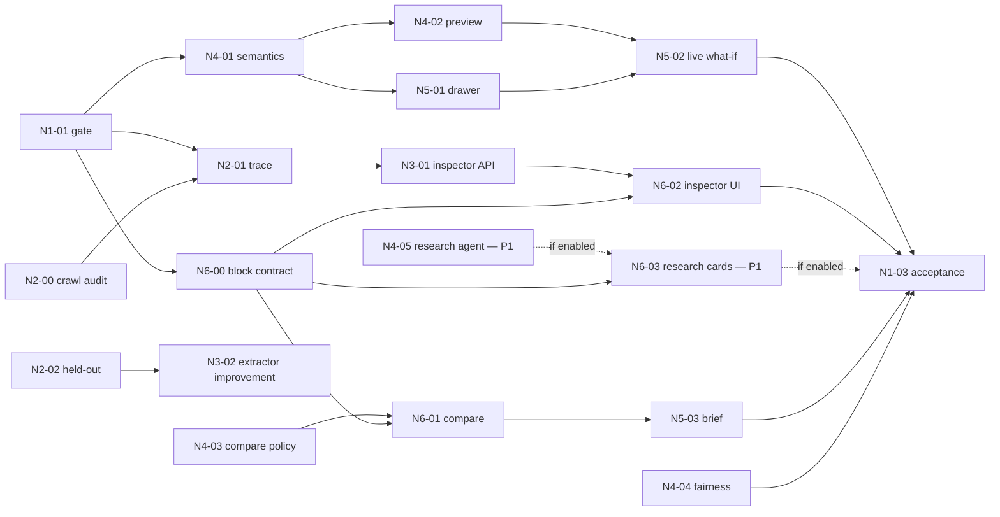

# DAY 3 TASKS — Breakdown M1–M6

## 0. Rule chung

Mỗi task chỉ `DONE` khi có đủ: artifact, test command/output, commit, limitation, consumer acknowledgement. Task không áp dụng phải ghi `NOT_APPLICABLE` cùng lý do. Mọi thay đổi contract phải cập nhật `docs/API_CONTRACT.md`, Pydantic, TypeScript và mock trong cùng PR.

Nhánh đề xuất: `feat/<TASK-ID>-slug`. Prefix task ngày dư: `N1`…`N6` theo owner.

Mỗi người chỉ giữ tối đa một task `IN_PROGRESS`. Board dùng trạng thái `READY → IN_PROGRESS → IN_REVIEW → VERIFIED → DONE`; owner không tự chuyển từ `IN_REVIEW` sang `VERIFIED`. Handoff phải ghi commit, files/API/artifact đã đổi, command đã chạy, kết quả, env/fixture, risk/limitation và tên consumer đã xác nhận.

## 0A. Active core-hardening lane — bắt buộc trước N1…N6

Canonical cards: [PERSONA_WORKFLOW_HARDENING.md](PERSONA_WORKFLOW_HARDENING.md). Branch:
`codex/persona-workflow-hardening`. Tất cả N1…N6 đang **BLOCKED_BY_CORE_GATE** cho tới khi
PH-M1-01 current-commit CI xanh và PH-M1-02 deploy smoke có evidence thật.

| Owner | Task | Vấn đề phải xử lý | Expected / verify | Trạng thái |
|---|---|---|---|---|
| M1 | PH-M1-01 | Baseline xanh không chứng minh hardening mới xanh | Backend compile/unit/contract/integration/e2e/runtime pipeline + 81 FE tests/typecheck/build; SHA + CI URL + secret/diff check | VERIFIED_CI — product-code `2fc677e`, run 29660149913 |
| M1 | PH-M1-02 | Vercel đang redirect login; Render URL chưa xác minh | Incognito 6 routes, health/CORS/cold-start, replay/live kill switch, rollback ID | BLOCKED_EXTERNAL |
| M1 | PH-M1-03 | Chưa có evidence người dùng/counselor | 2 Explore + 2 Launch + 1 counselor, denominators và ≥1 observed fix | NOT_RUN |
| M2 | PH-M2-01 | Persona output chưa được trace về snapshot | 15-row top-3 audit; source/hash/count/confidence; null/suppression đúng | READY — automated core gate xanh |
| M3 | PH-M3-01 | Cần chứng minh ranking khác nhau vì evidence, không vì hardcode/tune cảm giác | 5 persona score-component report; ≥4 unique top-1; 5 unique top-3; paired region/bias | VERIFIED_CI |
| M4 | PH-M4-01 | Negation/no-accent/agent correction có thể tạo hoặc xóa evidence sai | Single-tool planner; code-owned correction args; no null-field erase; provider fallback; persona E2E | VERIFIED_CI |
| M4 | PH-M4-02 | Explanation từng dùng skill đầu tiên cho nghề không liên quan | Relation-specific evidence, grounded digits, blank profile 409, route invariant | VERIFIED_CI |
| M5 | PH-M5-01 | Session cũ, mock cố định/reload và stale response làm persona trộn nhau | New UUID/resume/restart/mode/race/mock parity; mobile 390px; reset error retry | VERIFIED_CI + browser local |
| M6 | PH-M6-01 | Compare/research/what-if khó thấy, region bị hardcode, Launch readiness bị chôn sau hai click | Compare-first, jump nav, region selector, readiness summary + one-click 30-day plan, retry/new profile, source/confidence/null/error states | VERIFIED_CI + browser local |

Handoff bắt buộc cho lane này:

```text
Task/owner:
Current commit:
Problem reproduced with persona:
Files/contracts changed:
Targeted test + result:
Required layer test + result:
What was NOT_RUN and why:
Consumer/reviewer acknowledgement:
Known risk / rollback:
```

## Capacity map và thứ tự ưu tiên

| Owner | P0 critical lane | P1 chỉ mở sau H+17 | Reviewer chính | Budget định hướng |
|---|---|---|---|---:|
| M1 | N1-01 → N1-02 → N1-03 | release polish | tất cả contract/release | 20–24h |
| M2 | N2-00 → N2-01 → N2-02 | N2-03 route QA | M3 artifacts | 16–20h + support |
| M3 | N3-01 → N3-02 | N3-03 skill bridge | M2 data, M4 numbers | 16–20h |
| M4 | N4-01 → N4-02 → N4-03 → N4-04 | N4-05 research contract/replay/live | M5/M6 policy | 20–24h |
| M5 | N5-01 → N5-02 → N5-03 | brief polish | M4 preview semantics | 18–22h |
| M6 | N6-00 → N6-01 → N6-02 → N6-04 | N6-03 research cards | M3/M4 contracts | 20–24h |

Nếu owner xong sớm, lấy task support đã ghi trong handoff của lane kế tiếp; không tự mở P1/P2. M4/M6 không để live search làm trễ What-if/Inspector; M2/M3 không publish artifact khi quality gate chưa pass.

## M1 — Integration, release và evidence

### N1-01 — Expansion Gate và baseline freeze (H+0–1)

- **Problem:** mở feature khi core chưa ổn sẽ làm mất demo.
- **Actions:** chạy test matrix; ghi commit baseline; xác nhận data snapshot/report/hash, source limitation, replay, Sev-1/2, owner và rollback; đóng băng contract cũ; chốt `WEB_RESEARCH_MODE=off|replay` ở baseline.
- **Expected:** `docs/next/RELEASE_SCORECARD.md` được tạo từ template trong `EVALUATION.md`.
- **Tests:** backend unit/contract/integration; FE typecheck/build; Explore/Launch/replay smoke; raw/secret scan; boot không cần DDG/network.
- **DoD:** mọi gate trong `README.md` pass hoặc kế hoạch ngày dư bị hủy.
- **Risk/fallback:** bất kỳ P0 fail → M1 chuyển toàn team về core bug list.
- **Handoff:** baseline commit + commands → M2–M6.

### N1-02 — Contract/integration control (H+1–15)

- **Problem:** compare/what-if/provenance dễ tạo field lệch FE–BE.
- **Actions:** review sample payload; quản lý contract change; chốt endpoint/shape cho preview và research; merge theo thứ tự M2/M3/M4 → M5/M6; smoke sau mỗi merge.
- **Expected:** contract diff nhỏ, mock/live/replay parity.
- **Tests:** OpenAPI/Pydantic/TS fixture parity; error/null/low-confidence/live-cached-replay-unavailable cases; stale/foreign career ID.
- **DoD:** không consumer nào tự suy đoán field; main xanh sau từng merge.
- **Fallback:** cắt field mới và dùng presentation từ contract hiện có.
- **Handoff:** integration status mỗi checkpoint H+8/H+12/H+15.

### N1-03 — Acceptance, user test và release (H+15–24)

- **Actions:** chạy 3 E2E; test search-off/replay/live; điều phối 2 sinh viên Explore, 2 Launch và 1–2 counselor; ưu tiên 1 fix dựa trên quan sát; claim audit; rehearsal/rollback.
- **Expected:** scorecard thật, screenshot/video backup, demo script cập nhật.
- **Tests:** tasks U1–U5 và U6 nếu Research bật trong `EVALUATION.md`; ngắt model/network, và nếu có DDG thì bật replay/xác nhận research không đổi profile/candidate order.
- **DoD:** không Sev-1/2, 2 rehearsal pass, mọi metric ghi đúng sample size.
- **Fallback:** feature fail bị ẩn bằng feature flag; demo core cũ.
- **Handoff:** release commit + known limitations → presenter.

## M2 — Data traceability và held-out quality

### N2-00 — Public snapshot capture và acquisition audit (pre-H+0, tối đa H+3)

- **Problem:** quota crawl không phản ánh public inventory; cố đạt quota bằng duplicate, cookie hoặc bypass sẽ làm dữ liệu và claim mất tin cậy.
- **Actions:** inventory public sitemaps; canary 3 URL/source; crawl VietnamWorks cap 3.000 usable, ITviec cap 3.000 hoặc toàn public inventory, TopCV cap 1.000; delay/retry/resume; dừng 401/403/429/CAPTCHA; ghi requested/discovered/attempted/usable/unique/parse/http/block/stop/hash theo source. Phân biệt `run_*` với `snapshot/cumulative_*` và giữ run history để retry không ghi đè mất attempted/discovered cũ. Raw để trong `data/raw` gitignored.
- **Expected:** ba report JSON + JSONL local; source limitation rõ; không raw text/cookie/token trong commit.
- **Tests:** `backend/tests/unit/test_public_crawler.py`; canary schema; resume/high-water; stable ID/URL; secret scan; `git status` không thấy raw.
- **DoD:** report tái hiện số record thực, unique ID=unique URL=usable; blocked source được dừng và không được claim representative; M1/M3 nhận path/hash.
- **Risk/fallback:** inventory thấp → lấy toàn bộ và ghi limitation; source block → giữ partial snapshot hoặc exclude, không bypass.
- **Handoff:** source reports, snapshot paths/hashes, command và caveats → N2-01, N3-01, N1-01.

### N2-01 — Snapshot trace pack (H+1–6)

- **Problem:** aggregate đẹp nhưng judge không thấy đường từ source tới signal.
- **Actions:** normalize raw; khóa snapshot ID/hash; profile coverage theo source; report count theo source/region/time; exact/near dedupe, salary/date parse, career/region unmapped; chọn 10 aggregate và truy ngược posting IDs nội bộ. Chuẩn hóa pipeline entrypoint/README với explicit input/output, `--help`/`--dry-run` không side-effect, atomic output và command manifest để không vô tình chạy pipeline khi chỉ kiểm tra CLI. Thay fuzzy dedupe quét toàn bộ O(n²) bằng blocking key source/company/title tokens/date bucket trước khi `SequenceMatcher`, nhưng giữ fixture chứng minh kết quả baseline không regress.
- **Known blockers từ acquisition audit:** ITviec có `baseSalary` marketing copy phải chuyển null/“thỏa thuận”; VietnamWorks có location ID số cần mapping có version hoặc suppress; TopCV partial snapshot bị 403 và date concentration không được dùng làm trend. Không publish Salary/Region/Trend cho tới khi từng blocker có test + coverage report.
- **Expected:** machine-readable manifest + sanitized trace fixture; không commit raw licensed text.
- **Tests:** schema/hash reproducibility; `--help`/dry-run không tạo artifact; interrupted build không ghi đè artifact tốt; duplicate/coverage thresholds; salary outlier/n<5 suppression; 10/10 aggregate trace; source URL/date present.
- **DoD:** M3 tái tạo đúng count; M6 render được source/sample/confidence.
- **Fallback:** chỉ expose source/count/date; bỏ trace-level UI nếu terms không cho phép.
- **Handoff:** snapshot/version/caveats → M3, M6, M1.

### N2-02 — Held-out annotation và error taxonomy (H+6–12)

- **Problem:** F1 chung không cho biết extractor sai ở tiếng Việt, alias hay nghề nào.
- **Actions:** rà ít nhất 40 postings held-out cân bằng vùng/nhóm nghề; tag false positive/negative theo nguyên nhân; không dùng set này để tune trước baseline.
- **Expected:** error matrix: alias, negation, requirement-vs-nice-to-have, tool/version, soft skill ambiguity, title mapping.
- **Tests:** reviewer agreement trên 10 mẫu chồng lặp; không PII/raw text trái license trong repo.
- **DoD:** M3 nhận top 3 lỗi có impact và baseline metrics.
- **Fallback:** 20 mẫu nếu thời gian thiếu; ưu tiên non-IT/vocational và negation.
- **Handoff:** held-out report → N3-02.

### N2-03 — Route reality check (H+12–16)

- **Actions:** spot-check route/first step cho 10 careers, ưu tiên vocational/non-IT; kiểm tra không có học phí/thời lượng/cam kết việc làm vô nguồn.
- **Expected:** route QA report và correction PR nhỏ nếu cần.
- **Tests:** route invariant + source/claim lint thủ công hai reviewer.
- **DoD:** 10/10 career pass hoặc bad route bị ẩn.
- **Handoff:** verified routes → M4/M6.

## M3 — Market AI và Signal Inspector backend

### N3-01 — Signal Inspector query model (H+1–7)

- **Problem:** API market cần đủ evidence để giải thích confidence.
- **Actions:** chạy normalize→extract→map→aggregate từ N2-00; pin input/taxonomy/KB/pipeline hashes; chỉ publish artifact nếu QA gate pass; expose hoặc chuẩn hóa snapshot/source/sample/salary coverage/freshness/trend confidence/top co-skills; không scan raw JSON per request.
- **Expected:** typed service + fixture/API response cho career/skill detail.
- **Tests:** empty region; source partial; sample thấp; salary n<5→null; một snapshot/thiếu window→trend low confidence hoặc null; provenance bắt buộc; artifact rebuild deterministic.
- **DoD:** M6 render được inspector mà không tự tính số.
- **Fallback:** trả subset source/count/date/confidence từ `meta` và stats hiện có.
- **Handoff:** sample request/response + snapshot hash → M6/M1.

### N3-02 — Extractor error-driven improvement (H+7–14)

- **Problem:** ngày dư chỉ đáng dùng để tune AI nếu metric held-out tăng thật.
- **Actions:** chạy baseline trên N2-02; chọn tối đa 2 thay đổi taxonomy/rule/prompt; chạy lại fixed held-out; lưu before/after và regressions.
- **Expected:** confusion report, cost/latency và artifact version mới nếu có improvement.
- **Tests:** precision/recall/F1 micro; non-IT slice; negation slice; malformed structured output fallback.
- **DoD:** merge khi precision không giảm quá 0.01 và F1 hoặc critical slice tăng; nếu không, giữ baseline và ghi học được gì.
- **Fallback:** không merge tuning; dùng report như evidence trung thực.
- **Handoff:** metrics + taxonomy/model/hash → M1/M4.

### N3-03 — Skill bridge computation (P1, H+17–20)

- **Actions:** từ career KB + co-occurrence đã aggregate, trả careers liên quan đến một skill; threshold/sample/confidence rõ.
- **Tests:** không career ngoài KB; region không hard-filter; low sample suppressed; deterministic ordering.
- **DoD:** M6 có thể nói “skill này xuất hiện ở các nhóm nghề…” mà không gọi đó là đảm bảo cơ hội.
- **Fallback:** cắt P1, không ảnh hưởng inspector.

## M4 — Counterfactual, policy và explainability

### N4-01 — What-if domain contract (H+1–4)

- **Problem:** preview không được ghi đè profile hoặc cho LLM tự quyết định ranking.
- **Actions:** định nghĩa allowed mutations, working-copy semantics, max one mutation, undo/confirm; chốt output delta.
- **Expected:** design fixture cho add/remove skill, interest/dimension và constraint.
- **Tests:** forbidden gender/school/GPA mutation; invalid value; profile original unchanged.
- **DoD:** M1/M5 xác nhận semantics trước khi code UI.
- **Fallback:** chỉ dùng counterfactual hiện có read-only.
- **Handoff:** fixture + policy matrix → M5/M6.

### N4-02 — Deterministic preview + delta (H+4–10)

- **Actions:** clone validated profile; áp mutation; chạy matching/pathway core; tính added/removed/reordered options và factor deltas; LLM chỉ phrasing từ validated delta nếu dùng.
- **Expected:** service/endpoint hoặc adapter theo quyết định contract; undo không persistence, confirm mới patch.
- **Tests:** deterministic same input; no mutation leak; number grounding; region/gender/school invariance; route invariant; timeout fallback.
- **DoD:** 8 fixtures Explore/Launch pass; original session unchanged sau preview.
- **Fallback:** template explanation; không gọi LLM.
- **Handoff:** API/fixture/test evidence → M5/M6/M1.

### N4-03 — Compare explanation policy (H+8–13)

- **Actions:** tạo factors chung để compare: user evidence, observed market, routes, constraints, uncertainty, next step; không gắn nhãn winner/best.
- **Expected:** compare view-model hoặc deterministic selector; câu hỏi counselor gợi mở.
- **Tests:** missing/low-confidence/null salary; no top-1 verdict; every digit grounded; stretch retained.
- **DoD:** M6 không cần tạo explanation riêng trong component.
- **Handoff:** copy/fixtures → M6.

### N4-04 — Expanded fairness/red-team (H+12–16)

- **Actions:** paired test what-if/compare cho gender wording, school prestige, region, budget constraint và stereotype prompt injection.
- **Expected:** audit appendix có failure/fix thật.
- **Tests:** candidate set/readiness tolerance; region never filters; budget changes route emphasis but không xóa toàn bộ options; tool allowlist unchanged.
- **DoD:** 100% hard invariants pass; fail thì disable what-if.
- **Handoff:** pass/fail + claim boundary → M1.

### N4-05 — Career Research agent + DuckDuckGo spike (P1, H+17–20)

- **Problem:** LLM prose không phải bằng chứng hiện tại; generic browser tool có thể rò PII, bị prompt injection, rate-limit hoặc âm thầm ảnh hưởng recommendation.
- **Actions contract/replay trước:** định nghĩa `research` stage, request/result Pydantic, allowlist chỉ `get_market_context` + `search_career_sources`; validate 1–2 career IDs thuộc recommendation; code-built query theo intent/region; typed citations; replay/local fallback; feature flag `off|replay|ddg`.
- **Actions spike:** pin `ddgs==9.14.4`, ép backend DuckDuckGo; đo 10 query tiếng Việt cho 5 career families; timeout 4s, max 1 search call/5 results, TTL cache; kiểm tra empty/rate-limit/malformed URL. Package là community adapter, không được mô tả như official DuckDuckGo API.
- **Actions live:** chỉ bật khi core xanh, contract/replay pass và spike đạt gate; sanitize HTML/length/URL, classify source tier, compose `InsightBlock[]`; không arbitrary page fetch.
- **Expected:** `POST /api/research/careers` hoặc contract tương đương; policy matrix; 10 replay fixtures; live status `live|cached|replay|unavailable`; local market block luôn dùng snapshot.
- **Tests:** tool-selection/args; no name/gender/school/GPA/raw transcript in query; SSRF/private URL reject; prompt injection trong query/snippet; timeout/rate-limit; citation required; every market number grounded; candidate order/profile unchanged byte-for-byte.
- **DoD:** replay/local E2E pass và boot/test không cần DDG/network; live chỉ ship nếu ≥8/10 spike queries trả ≥3 relevant links trong budget, p95 ≤4s hoặc cache, 0 policy/grounding violation.
- **Risk/fallback:** DDG không ổn định/terms chưa rõ → `WEB_RESEARCH_MODE=replay|off`, hiển thị local context + curated fixtures; không chặn core release.
- **Handoff:** contract, fixtures, policy reason codes, env/kill switch và latency report → M1, N6-03.

## M5 — What-if UX và profile autonomy

### N5-01 — What-if drawer trên mock (H+2–7)

- **Problem:** user phải hiểu đây là thử giả định, không phải sửa hồ sơ ngay.
- **Actions:** mutation selector, current/preview state, “Thử thay đổi”, “Hoàn tác”, “Xác nhận cập nhật”; chỉ một mutation; natural Vietnamese copy.
- **Expected:** responsive component dùng fixture N4-01.
- **Tests:** keyboard/focus; loading/error; duplicate click; invalid mutation; mobile; undo.
- **DoD:** user phân biệt preview với saved profile trong usability dry-run.
- **Fallback:** read-only preset counterfactual card.
- **Handoff:** state matrix/screenshots → M4/M6/M1.

### N5-02 — Live preview integration (H+8–13)

- **Actions:** gọi API qua `lib/api.ts`; mock/live/replay cùng shape; optimistic UI chỉ cho preview; confirm mới patch.
- **Tests:** timeout/retry; 404 session; server validation; refresh; confirm/undo; original profile unchanged on failure.
- **DoD:** Explore và Launch preview chạy; không raw error/trace.
- **Fallback:** feature flag tắt live preview, giữ preset demo.
- **Handoff:** integrated flow → M1/M6.

### N5-03 — Counselor Brief shell/print (H+10–16)

- **Actions:** print layout từ confirmed profile + selected options; source/limitations; discussion questions; clear-before-print; không raw chat.
- **Tests:** print preview A4; long Vietnamese; null data; no session ID/API key/raw transcript; local-only name.
- **DoD:** counselor tìm được evidence, alternatives và next questions trong ≤60 giây.
- **Fallback:** browser print của structured HTML, không PDF library.
- **Handoff:** print artifact → M1 user test/M6 visual review.

## M6 — Compare, Signal Inspector và demo surface

### N6-00 — Structured insight design system và component contract (H+1–4)

- **Problem:** trả một đoạn text dài làm user khó so sánh, khó thấy nguồn và khiến LLM có thể tạo presentation không nhất quán.
- **Actions:** tạo `InsightBlock` discriminated union và allowlisted components; map Cream Paper/Schematic Blue/Ink/Orange tokens; serif cho reading, mono cho UI/data; wireframe mobile/desktop cho metric strip, skill table, compare, route, source cards, caveat; loại login/pricing/marketing khỏi design reference.
- **Expected:** typed fixture + component/state matrix cho normal/loading/empty/low-confidence/error/replay; mỗi số có `sourceRef`; source/limitation luôn nhìn thấy.
- **Tests:** TS exhaustive switch; malformed/unknown block fallback; contrast/keyboard/mobile; long Vietnamese/null; không render raw HTML từ agent.
- **DoD:** M3/M4 ký sample payload; cùng fixture render deterministic; một user tìm source/confidence ≤20 giây trong dry-run.
- **Fallback:** fixed stacked cards/table dùng contract hiện có, không dynamic chart.
- **Handoff:** tokens, fixtures, block renderer skeleton → N6-01/N6-02/N6-03.

### N6-01 — Compare 2 options (H+2–8)

- **Problem:** ranking list dễ khiến user hiểu top-1 là verdict.
- **Actions:** select tối đa 2; bảng compare factors; equal visual weight; route types; low-confidence; CTA what-if/brief.
- **Expected:** mock implementation cho Explore/Launch; accessible mobile stack.
- **Tests:** 0/1/2 selection; stretch; null salary/readiness; keyboard; long text; non-university route visible.
- **DoD:** không có “winner/best”; user nói lại được ít nhất một trade-off.
- **Fallback:** stacked cards không chart.
- **Handoff:** selected IDs/state → M5 Brief và M1.

### N6-02 — Signal Inspector UI (H+6–12)

- **Actions:** panel source/date/count/sample/confidence/coverage/co-skills; plain-language tooltip giải thích observed demand; accessible table fallback.
- **Tests:** low confidence; n<5 salary; missing trend; mixed sources; mobile; source note always visible.
- **DoD:** judge truy được một số về snapshot metadata trong ≤20 giây.
- **Fallback:** compact provenance panel; bỏ chart/co-skills.
- **Handoff:** screenshots + data-state matrix → M1.

### N6-03 — Career Research Cards (P1, H+17–20)

- **Actions:** CTA “Nghiên cứu thêm” chỉ sau result; intent selector overview/skills/routes/local market; render local metric + source grid; domain/tier/date/status/limitation; external-link warning; không chat prose dài và không hiển thị raw agent trace.
- **Tests:** 0/1/2 selected careers; stale/foreign ID; live/cached/replay/unavailable; timeout/retry-one-click; malicious/long snippet; keyboard/mobile; recommendation order trước/sau giống nhau.
- **DoD:** replay/local flow pass, every source card có URL/domain/retrieved date/status; live DDG chỉ bật khi N4-05 go; lỗi live chuyển fallback không layout shift/5xx.
- **Fallback:** ẩn CTA live và giữ “Nguồn & cách đọc số liệu” từ snapshot.
- **Handoff:** screenshots/state matrix/E2E selector → M1/N6-04.

### N6-04 — Live integration và pitch polish (H+12–20)

- **Actions:** wire N3/N4; verify mock/live/replay/search-off; refine hierarchy; capture screenshots; update 60-second narrative.
- **Tests:** FE typecheck/build; E2E Compare→Inspector→Research→What-if→Brief; contrast/keyboard/mobile.
- **DoD:** no layout shift/blocker; source/limitation không bị giấu; demo ≤4 phút.
- **Fallback:** feature flags tắt từng phần độc lập.
- **Handoff:** release UI → M1.

## Dependency graph


